# SOA Exam P Sample Exam

Source: dki.io/ab640089 (dominKnow share), course "Sample Exam P", 197 questions in 9 banks, 3-hour time limit. Captured 2026-09-06. Question titles keep the numbering used in the source. Worked math in the solutions is in the images under images/.

## Sample Exam P Bank 1 - 5 questions

### Bank 1 Question 1

A survey of a group’s viewing habits over the last year revealed the following information:

(i) 28% watched gymnastics
(ii) 29% watched baseball
(iii) 19% watched soccer
(iv) 14% watched gymnastics and baseball

(v) 12% watched baseball and soccer
(vi) 10% watched gymnastics and soccer
(vii) 8% watched all three sports.

Calculate the percentage of the group that watched none of the three sports during the last year.

- (A) 24%
- (B) 36%
- (C) 41%
- (D) 52% **(correct)**
- (E) 60%

**Solution**

Let G = viewer watched gymnastics, B = viewer watched baseball, S = viewer watched soccer. Then we want to find:

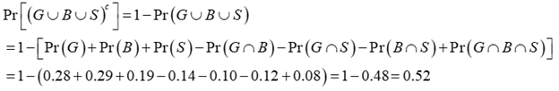

### Bank 1 Question 2

The probability that a visit to a primary care physician’s (PCP) office results in neither lab work nor referral to a specialist is 35%. Of those coming to a PCP’s office, 30% are referred to specialists and 40% require lab work.

Calculate the probability that a visit to a PCP’s office results in both lab work and referral to a specialist.

- (A) 0.05 **(correct)**
- (B) 0.12
- (C) 0.18
- (D) 0.25
- (E) 0.35

**Solution**

Let *R* = referral to a specialist and *L* = lab work. Then

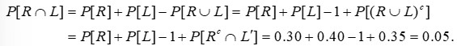

### Bank 1 Question 3

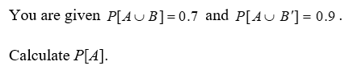

- (A) 0.2
- (B) 0.3
- (C) 0.4
- (D) 0.6 **(correct)**
- (E) 0.8

**Solution**

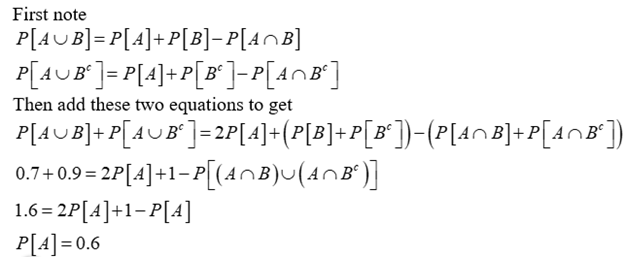

### Bank 1 Question 4

An urn contains 10 balls: 4 red and 6 blue. A second urn contains 16 red balls and an unknown number of blue balls. A single ball is drawn from each urn. The probability that both balls are the same color is 0.44.

Calculate the number of blue balls in the second urn.

- (A) 4 **(correct)**
- (B) 20
- (C) 24
- (D) 44
- (E) 64

**Solution**

For* i* = 1,2, let *Ri* = event that a red ball is drawn from urn *i* and let *Bi* = event that a blue ball is drawn from urn *i.* Then, if *x* is the number of blue balls in urn 2,

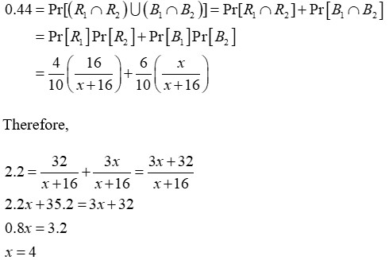

### Bank 1 Question 5

An auto insurance company has 10,000 policyholders. Each policyholder is classified as

(i) young or old;
(ii) male or female; and
(iii) married or single.

Of these policyholders, 3000 are young, 4600 are male, and 7000 are married. The policyholders can also be classified as 1320 young males, 3010 married males, and 1400 young married persons. Finally, 600 of the policyholders are young married males.

Calculate the number of the company’s policyholders who are young, female, and single.

- (A) 280
- (B) 423
- (C) 486
- (D) 880 **(correct)**
- (E) 896

**Solution**

Let *N(C)* denote the number of policyholders in classification *C*. Then
*N(*Young and Female and Single)
= *N*(Young and Female) – *N*(Young and Female and Married)
= *N*(Young) – *N*(Young and Male) – [*N*(Young and Married) – *N*(Young and Married and Male)]
= 3000 – 1320 – (1400 – 600) = 880.

### Bank 1 Question 7

An insurance company estimates that 40% of policyholders who have only an auto policy will renew next year and 60% of policyholders who have only a homeowners policy will renew next year. The company estimates that 80% of policyholders who have both an auto policy and a homeowners policy will renew at least one of those policies next year.

Company records show that 65% of policyholders have an auto policy, 50% of policyholders have a homeowners policy, and 15% of policyholders have both an auto policy and a homeowners policy.

Using the company’s estimates, calculate the percentage of policyholders that will renew at least one policy next year.

- (A) 20%
- (B) 29%
- (C) 41%
- (D) 53% **(correct)**
- (E) 70%

**Solution**

Let *A* = event that a policyholder has an auto policy and *H* = event that a policyholder has a homeowners policy. Then,

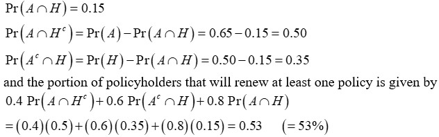

### Bank 1 Question 8

Among a large group of patients recovering from shoulder injuries, it is found that 22% visit both a physical therapist and a chiropractor, whereas 12% visit neither of these. The probability that a patient visits a chiropractor exceeds by 0.14 the probability that a patient visits a physical therapist.

Calculate the probability that a randomly chosen member of this group visits a physical therapist.

- (A) 0.26
- (B) 0.38
- (C) 0.40
- (D) 0.48 **(correct)**
- (E) 0.62

**Solution**

Let *C* = event that patient visits a chiropractor and *T* = event that patient visits a physical therapist. We are given that

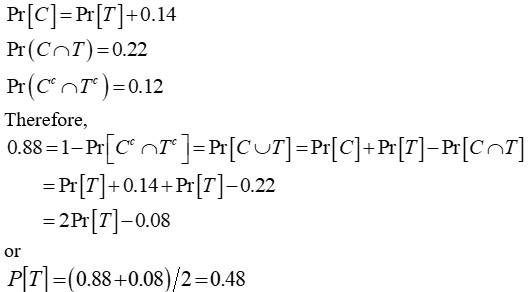

### Bank 1 Question 10

An actuary studying the insurance preferences of automobile owners makes the following conclusions:

(i) An automobile owner is twice as likely to purchase collision coverage as disability coverage.
(ii) The event that an automobile owner purchases collision coverage is independent of the event that he or she purchases disability coverage.
(iii) The probability that an automobile owner purchases both collision and disability coverages is 0.15.

Calculate the probability that that an automobile owner purchases neither collision nor disability coverage.

- (A) 0.18
- (B) 0.33 **(correct)**
- (C) 0.48
- (D) 0.67
- (E) 0.82

**Solution**

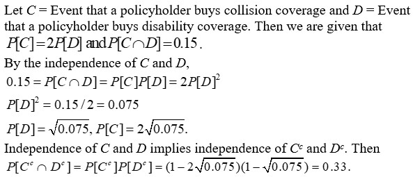

### Bank 1 Question 14

An insurer offers a health plan to the employees of a large company. As part of this plan, the individual employees may choose exactly two of the supplementary coverages A, B, and C, or they may choose no supplementary coverage. The proportions of the company’s employees that choose coverages A, B, and C are 1/4, 1/3, and 5/12 respectively.

Calculate the probability that a randomly chosen employee will choose no supplementary coverage.

- (A) 0
- (B) 47/144
- (C) 1/2 **(correct)**
- (D) 97/144
- (E) 7/9

**Solution**

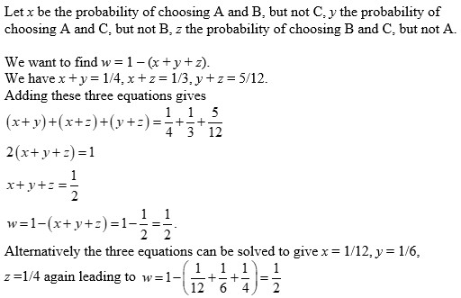

### Bank 1 Question 16

An insurance company pays hospital claims.  The number of claims that include emergency room or operating room charges is 85% of the total number of claims.  The number of claims that do not include emergency room charges is 25% of the total number of claims.  The occurrence of emergency room charges is independent of the occurrence of operating room charges on hospital claims.
 
Calculate the probability that a claim submitted to the insurance company includes operating room charges.

- (A) 0.10
- (B) 0.20
- (C) 0.25
- (D) 0.40 **(correct)**
- (E) 0.80

**Solution**

Let *O *= event of operating room charges and *E* = event of emergency room charges. Then

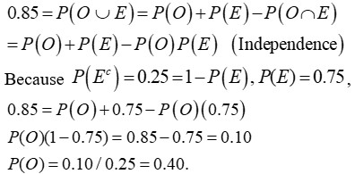

### Bank 1 Question 87

An insurance agent offers his clients auto insurance, homeowners insurance and renters insurance.  The purchase of homeowners insurance and the purchase of renters insurance are mutually exclusive.  The profile of the agent’s clients is as follows:
i)          17% of the clients have none of these three products.
ii)        64% of the clients have auto insurance.
iii)       Twice as many of the clients have homeowners insurance as have renters insurance.
iv)       35% of the clients have two of these three products.
v)         11% of the clients have homeowners insurance, but not auto insurance.
 
Calculate the percentage of the agent’s clients that have both auto and renters insurance.

- (A) 7%
- (B) 10% **(correct)**
- (C) 16%
- (D) 25%
- (E) 28%

**Solution**

Let *H* be the percentage of clients with homeowners insurance and *R* be the percentage of clients with renters insurance.

Because 36% of clients do not have auto insurance and none have both homeowners and renters insurance, we calculate that 8% (36% – 17% – 11%) must have renters insurance, but not auto insurance.

(*H* – 11)% have both homeowners and auto insurance, (*R* – 8)% have both renters and auto insurance, and none have both homeowners and renters insurance, so (*H* + *R* – 19)% must equal 35%. Because *H* = 2*R*, *R *must be 18%, which implies that 10% have both renters and auto insurance.

### Bank 1 Question 92

A mattress store sells only king, queen and twin-size mattresses.  Sales records at the store indicate that the number of queen-size mattresses sold is one-fourth the number of king and twin-size mattresses combined. Records also indicate that three times as many king-size mattresses are sold as twin-size mattresses. 
 
Calculate the probability that the next mattress sold is either king or queen-size.

- (A) 0.12
- (B) 0.15
- (C) 0.80 **(correct)**
- (D) 0.85
- (E) 0.95

**Solution**

Letting *t* denote the relative frequency with which twin-sized mattresses are sold, we have that the relative frequency with which king-sized mattresses are sold is 3*t* and the relative frequency with which queen-sized mattresses are sold is 
(3*t *+ *t*)/4 = *t*. Thus, *t* = 0.2 since *t* + 3*t* + *t* = 1. The probability we seek is 3*t* + *t* = 0.80.

### Bank 1 Question 97

Thirty items are arranged in a 6-by-5 array as shown.

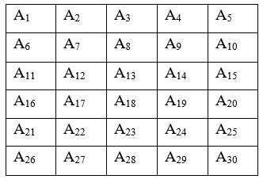

Calculate the number of ways to form a set of three distinct items such that no two of the selected items are in the same row or same column.

- (A) 200
- (B) 760
- (C) 1200 **(correct)**
- (D) 4560
- (E) 7200

**Solution**

There are 10 (5 choose 3) ways to select the three columns in which the three items will appear. The row of the rightmost selected item can be chosen in any of six ways, the row of the leftmost selected item can then be chosen in any of five ways, and the row of the middle selected item can then be chosen in any of four ways. The answer is thus (10)(6)(5)(4) = 1200. Alternatively, there are 30 ways to select the first item. Because there are 10 squares in the row or column of the first selected item, there are 30 − 10 = 20 ways to select the second item. Because there are 18 squares in the rows or columns of the first and second selected items, there are 30 − 18 = 12 ways to select the third item. The number of permutations of three qualifying items is (30)(20)(12). The number of combinations is thus (30)(20)(12)/3! = 1200.

### Bank 1 Question 99

The probability that a member of a certain class of homeowners with liability and property coverage will file a liability claim is 0.04, and the probability that a member of this class will file a property claim is 0.10.  The probability that a member of this class will file a liability claim but not a property claim is 0.01.
 
Calculate the probability that a randomly selected member of this class of homeowners will not file a claim of either type.

- (A) 0.850
- (B) 0.860
- (C) 0.864
- (D) 0.870
- (E) 0.890 **(correct)**

**Solution**

Liability but not property = 0.01 (given)
Liability and property = 0.04 – 0.01 = 0.03.
Property but not liability = 0.10 – 0.03 = 0.07
Probability of neither = 1 – 0.01 – 0.03 – 0.07 = 0.89

### Bank 1 Question 100

A survey of 100 TV viewers revealed that over the last year:
i) 34 watched CBS.
ii) 15 watched NBC.
iii) 10 watched ABC.
iv) 7 watched CBS and NBC.
v) 6 watched CBS and ABC.
vi) 5 watched NBC and ABC.
vii) 4 watched CBS, NBC, and ABC.
viii) 18 watched HGTV, and of these, none watched CBS, NBC, or ABC.
Calculate how many of the 100 TV viewers did not watch any of the four channels (CBS, NBC, ABC or HGTV).

- (A) 1
- (B) 37 **(correct)**
- (C) 45
- (D) 55
- (E) 82

**Solution**

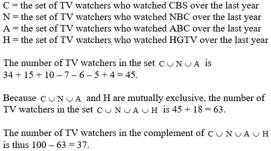

### Bank 1 Question 108

In a certain game of chance, a square board with area 1 is colored with sectors of either red or blue. A player, who cannot see the board, must specify a point on the board by giving an *x*-coordinate and a *y*-coordinate. The player wins the game if the specified point is in a blue sector. The game can be arranged with any number of red sectors, and the red sectors are designed so that

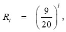

where *R_i* is the area of the *i^th* red sector.

Calculate the minimum number of red sectors that makes the chance of a player winning less than 20%.

- (A) 3
- (B) 4
- (C) 5 **(correct)**
- (D) 6
- (E) 7

**Solution**

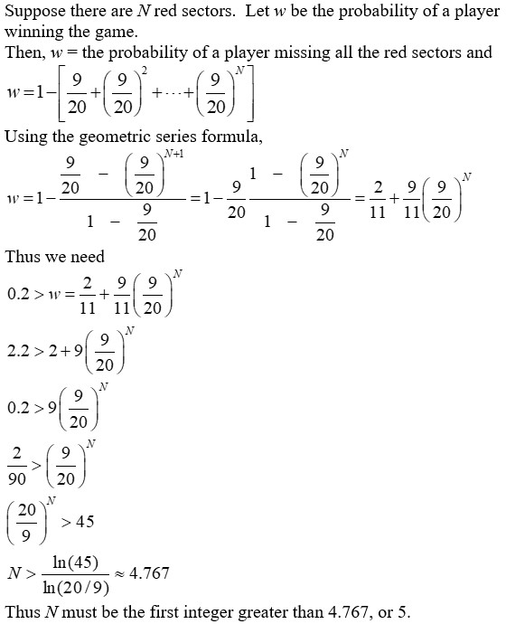

### Bank 1 Question 113

Two fair dice are rolled.  Let *X* be the absolute value of the difference between the two numbers on the dice.
 
Calculate the probability that *X* < 3.

- (A) 2/9
- (B) 1/3
- (C) 4/9
- (D) 5/9
- (E) 2/3 **(correct)**

**Solution**

The dice rolls that satisfy this event are  (1,1), (1,2), (1,3), (2,1), (2,2), (2,3), (2,4), (3,1), (3,2), (3,3), (3,4), (3,5), (4,2), (4,3), (4,4), (4,5), (4,6), (5,3), (5,4), (5,5), (5,6), (6,4), (6,5), and (6,6). They represent 24 of the 36 equally likely outcomes for a probability of 2/3.

### Bank 1 Question 120

Two fair dice, one red and one blue, are rolled. 

Let A be the event that the number rolled on the red die is odd.
Let B be the event that the number rolled on the blue die is odd. 
Let C be the event that the sum of the numbers rolled on the two dice is odd.
 
Determine which of the following is true.

- (A) A, B, and C are not mutually independent, but each pair is independent. **(correct)**
- (B) A, B, and C are mutually independent.
- (C) Exactly one pair of the three events is independent.
- (D) Exactly two of the three pairs are independent.
- (E) No pair of the three events is independent.

**Solution**

Each event has probability 0.5. Each of the three possible intersections of two events has probability 0.25 = (0.5)(0.5), so each pair is independent. The intersection of all three events has probability 0, which does not equal (0.5)(0.5)(0.5) and so the three events are not mutually independent.

### Bank 1 Question 121

An urn contains four fair dice.  Two have faces numbered 1, 2, 3, 4, 5, and 6; one has faces numbered 2, 2, 4, 4, 6, and 6; and one has all six faces numbered 6.  One of the dice is randomly selected from the urn and rolled.  The same die is rolled a second time.
 
Calculate the probability that a 6 is rolled both times.

- (A) 0.174
- (B) 0.250
- (C) 0.292 **(correct)**
- (D) 0.380
- (E) 0.417

**Solution**

Let event A be the selection of the die with faces (1,2,3,4,5,6), event B be the selection of the die with faces (2,2,4,4,6,6) and event C be the selection of the die with all 6’s. The desired probability is, using the law of total probability,

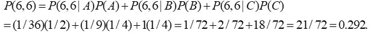

### Bank 1 Question 125

An electronic system contains three cooling components that operate independently.  The probability of each component’s failure is 0.05. The system will overheat if and only if at least two components fail.
 
Calculate the probability that the system will overheat.

- (A) 0.007 **(correct)**
- (B) 0.045
- (C) 0.098
- (D) 0.135
- (E) 0.143

**Solution**

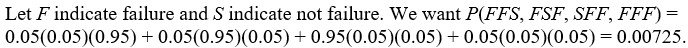

### Bank 1 Question 130

This year, a medical insurance policyholder has probability 0.70 of having no emergency room visits, 0.85 of having no hospital stays, and 0.61 of having neither emergency room visits nor hospital stays
 
Calculate the probability that the policyholder has at least one emergency room visit and at least one hospital stay this year.

- (A) 0.045
- (B) 0.060 **(correct)**
- (C) 0.390
- (D) 0.667
- (E) 0.840

**Solution**

*P*(at least one emergency room visit **or** at least one hospital stay) =
1 – 0.61 = 0.39 =
*P*(at least one emergency room visit) + *P*(at least one hospital stay) – *P*(at least one emergency room visit and at least one hospital stay).
 
*P*(at least one emergency room visit **a****nd **at least one hospital stay) =
1 – 0.70 + 1 – 0.85 – 0.39 = 0.060.

### Bank 1 Question 134

George and Paul play a betting game.  Each chooses an integer from 1 to 20 (inclusive) at random.  If the two numbers differ by more than 3, George wins the bet.  Otherwise, Paul wins the bet.
 
Calculate the probability that Paul wins the bet.

- (A) 0.27
- (B) 0.32 **(correct)**
- (C) 0.40
- (D) 0.48
- (E) 0.66

**Solution**

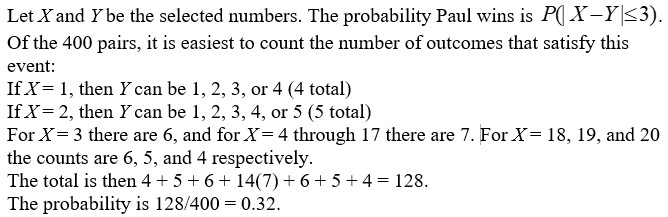

### Bank 1 Question 147

In a certain group of cancer patients, each patient's cancer is classified in exactly one of the following five stages: stage 0, stage 1, stage 2, stage 3, or stage 4.

i) 75% of the patients in the group have stage 2 or lower.
ii) 80% of the patients in the group have stage 1 or higher.
iii) 80% of the patients in the group have stage 0, 1, 3, or 4.

One patient from the group is randomly selected.

Calculate the probability that the selected patient's cancer is stage 1.

- (A) 0.20
- (B) 0.25
- (C) 0.35 **(correct)**
- (D) 0.48
- (E) 0.65

**Solution**

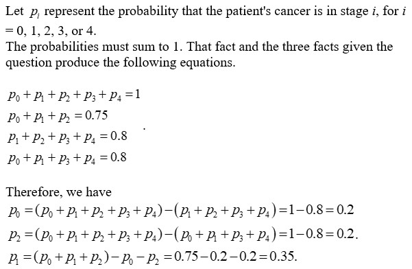

### Bank 1 Question 153

A policyholder purchases automobile insurance for two years. Define the following events:
F = the policyholder has exactly one accident in year one.
G = the policyholder has one or more accidents in year two.

Define the following events:
i) The policyholder has exactly one accident in year one and has more than one accident in year two.
ii) The policyholder has at least two accidents during the two-year period.
iii) The policyholder has exactly one accident in year one and has at least one accident in year two.
iv) The policyholder has exactly one accident in year one and has a total of two or more accidents in the two-year period.
v) The policyholder has exactly one accident in year one and has more accidents in year two than in year one.
Determine the number of events from the above list of five that are the same as

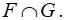

- (A) None
- (B) Exactly one
- (C) Exactly two **(correct)**
- (D) Exactly three
- (E) All

**Solution**

i) is false because G includes having one accident in year two.
ii) is false because there could be no accidents in year one.
iii) is true because it connects the descriptions of F and G (noting that “one or more” and “at least one” are identical events) with “and.”
iv) is true because given one accident in year one (F), having a total of two or more in two years is the same as one or more in year two (G).
v) is false because it requires year two to have at least two accidents.

## Sample Exam P Bank 2 - 3 questions

### Bank 2 Question 6

A public health researcher examines the medical records of a group of 937 men who died in 1999 and discovers that 210 of the men died from causes related to heart disease. Moreover, 312 of the 937 men had at least one parent who suffered from heart disease, and, of these 312 men, 102 died from causes related to heart disease.

Calculate the probability that a man randomly selected from this group died of causes related to heart disease, given that neither of his parents suffered from heart disease.

- (A) 0.115
- (B) 0.173 **(correct)**
- (C) 0.224
- (D) 0.327
- (E) 0.514

**Solution**

Let
*H* = event that a death is due to heart disease
*F* = event that at least one parent suffered from heart disease
Then based on the medical records,

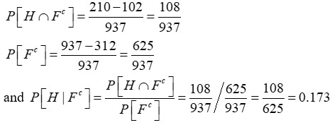

### Bank 2 Question 9

An insurance company examines its pool of auto insurance customers and gathers the following information:

(i)        All customers insure at least one car.
(ii)       70% of the customers insure more than one car.
(iii)      20% of the customers insure a sports car.
(iv)      Of those customers who insure more than one car, 15% insure a sports car.

Calculate the probability that a randomly selected customer insures exactly one car and that car is not a sports car.

- (A) 0.13
- (B) 0.21 **(correct)**
- (C) 0.24
- (D) 0.25
- (E) 0.30

**Solution**

Let *M* = event that customer insures more than one car and *S* = event that customer insurers a sports car. Then applying DeMorgan’s Law, compute the desired probability as:

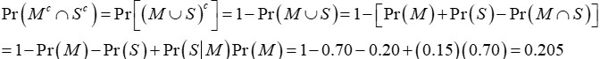

### Bank 2 Question 11

A doctor is studying the relationship between blood pressure and heartbeat abnormalities in her patients. She tests a random sample of her patients and notes their blood pressures (high, low, or normal) and their heartbeats (regular or irregular). She finds that:
(i) 14% have high blood pressure.
(ii) 22% have low blood pressure.
(iii) 15% have an irregular heartbeat.
(iv) Of those with an irregular heartbeat, one-third have high blood pressure.
(v) Of those with normal blood pressure, one-eighth have an irregular heartbeat.

Calculate the portion of the patients selected who have a regular heartbeat and low blood pressure.

- (A) 2%
- (B) 5%
- (C) 8%
- (D) 9%
- (E) 20% **(correct)**

**Solution**

"Boxed" numbers in the table below were computed.

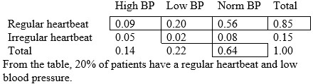

### Bank 2 Question 12

An actuary is studying the prevalence of three health risk factors, denoted by A, B, and C, within a population of women. For each of the three factors, the probability is 0.1 that a woman in the population has only this risk factor (and no others). For any two of the three factors, the probability is 0.12 that she has exactly these two risk factors (but not the other). The probability that a woman has all three risk factors, given that she has A and B, is 1/3.

Calculate the probability that a woman has none of the three risk factors, given that she does not have risk factor A.

- (A) 0.280
- (B) 0.311
- (C) 0.467 **(correct)**
- (D) 0.484
- (E) 0.700

**Solution**

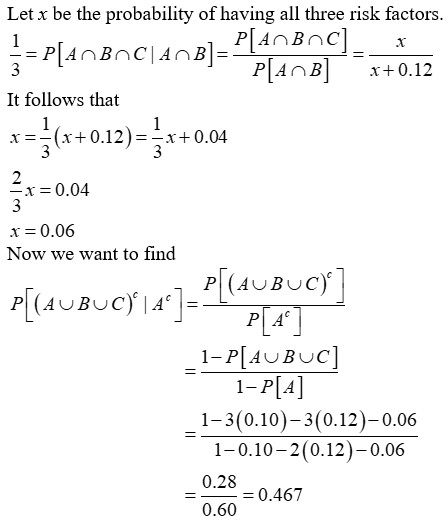

### Bank 2 Question 18

An auto insurance company insures drivers of all ages. An actuary compiled the following statistics on the company’s insured drivers:

| Age of Driver | Probability of Accident | Portion of Company's Insured Drivers |
|---|---|---|
| 16-20 | 0.06 | 0.08 |
| 21-30 | 0.03 | 0.15 |
| 31-65 | 0.02 | 0.49 |
| 66-99 | 0.04 | 0.28 |

A randomly selected driver that the company insures has an accident.
 
Calculate the probability that the driver was age 16-20.

- (A) 0.13
- (B) 0.16 **(correct)**
- (C) 0.19
- (D) 0.23
- (E) 0.40

**Solution**

Apply Bayes’ Formula. Let
*A* = Event of an accident
*B1 *= Event the driver’s age is in the range 16-20
*B2* = Event the driver’s age is in the range 21-30
*B3* = Event the driver’s age is in the range 30-65
*B4 *= Event the driver’s age is in the range 66-99
Then

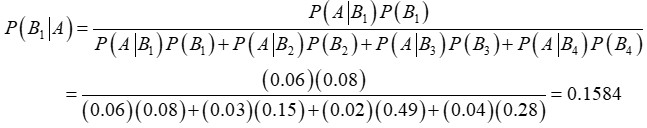

### Bank 2 Question 19

An insurance company issues life insurance policies in three separate categories: standard, preferred, and ultra-preferred. Of the company’s policyholders, 50% are standard, 40% are preferred, and 10% are ultra-preferred. Each standard policyholder has probability 0.010 of dying in the next year, each preferred policyholder has probability 0.005 of dying in the next year, and each ultra-preferred policyholder has probability 0.001 of dying in the next year.

A policyholder dies in the next year.

Calculate the probability that the deceased policyholder was ultra-preferred.

- (A) 0.0001
- (B) 0.0010
- (C) 0.0071
- (D) 0.0141 **(correct)**
- (E) 0.2817

**Solution**

Let
*S* = Event of a standard policy
*F* = Event of a preferred policy
*U* = Event of an ultra-preferred policy
*D* = Event that a policyholder dies
Then

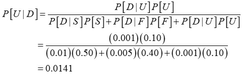

### Bank 2 Question 20

Upon arrival at a hospital’s emergency room, patients are categorized according to their condition as critical, serious, or stable. In the past year:(i) 10% of the emergency room patients were critical;
(ii) 30% of the emergency room patients were serious;
(iii) the rest of the emergency room patients were stable;
(iv) 40% of the critical patients died;
(vi) 10% of the serious patients died; and
(vii) 1% of the stable patients died.

Given that a patient survived, calculate the probability that the patient was categorized as serious upon arrival.

- (A) 0.06
- (B) 0.29 **(correct)**
- (C) 0.30
- (D) 0.39
- (E) 0.64

**Solution**

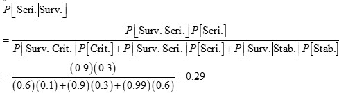

### Bank 2 Question 21

A health study tracked a group of persons for five years.  At the beginning of the study, 20% were classified as heavy smokers, 30% as light smokers, and 50% as nonsmokers.

Results of the study showed that light smokers were twice as likely as nonsmokers to die during the five-year study, but only half as likely as heavy smokers.
 
            A randomly selected participant from the study died during the five-year period.
 
            Calculate the probability that the participant was a heavy smoker.

- (A) 0.20
- (B) 0.25
- (C) 0.35
- (D) 0.42 **(correct)**
- (E) 0.57

**Solution**

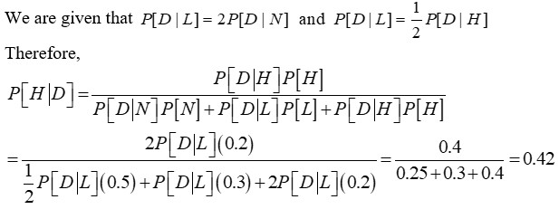

Let *H* = heavy smoker, *L* = light smoker, *N* = non-smoker, *D* = death within five-year period.

### Bank 2 Question 22

An actuary studied the likelihood that different types of drivers would be involved in at least one collision during any one-year period. The results of the study are:

| Type of driver | Percentage of all drivers | Probability of at least one collision |
|---|---|---|
| Teen | 8% | 0.15 |
| Young adult | 16% | 0.08 |
| Midlife | 45% | 0.04 |
| Senior | 31% | 0.05 |
| TOTAL | 100% |  |

Given that a driver has been involved in at least one collision in the past year, calculate the probability that the driver is a young adult driver.

- (A) 0.06
- (B) 0.16
- (C) 0.19
- (D) 0.22 **(correct)**
- (E) 0.25

**Solution**

Let *C* = Event of a collision
*T* = Event of a teen driver
*Y* = Event of a young adult driver
*M* = Event of a midlife driver
*S* = Event of a senior driver
Then,

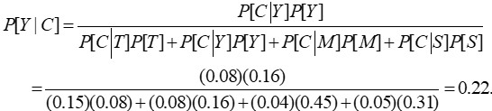

### Bank 2 Question 24

A blood test indicates the presence of a particular disease 95% of the time when the disease is actually present.  The same test indicates the presence of the disease 0.5% of the time when the disease is not actually present.  One percent of the population actually has the disease.
 
Calculate the probability that a person actually has the disease given that the test indicates the presence of the disease.

- (A) 0.324
- (B) 0.657 **(correct)**
- (C) 0.945
- (D) 0.950
- (E) 0.995

**Solution**

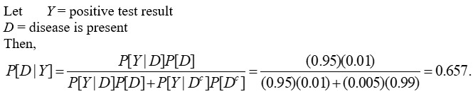

### Bank 2 Question 25

The probability that a randomly chosen male has a blood circulation problem is 0.25.  Males who have a blood circulation problem are twice as likely to be smokers as those who do not have a blood circulation problem.
 
Calculate the probability that a male has a blood circulation problem, given that he is a smoker.

- (A) 1/4
- (B) 1/3
- (C) 2/5 **(correct)**
- (D) 1/2
- (E) 2/3

**Solution**

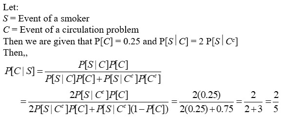

### Bank 2 Question 26

A study of automobile accidents produced the following data:

| Model year | Proportion of all vehicles | Probability of involvement in an accident |
|---|---|---|
| 2014 | 0.16 | 0.05 |
| 2013 | 0.18 | 0.02 |
| 2012 | 0.20 | 0.03 |
| Other | 0.46 | 0.04 |

An automobile from one of the model years 2014, 2013, and 2012 was involved in an accident.
 
Calculate the probability that the model year of this automobile is 2014.

- (A) 0.22
- (B) 0.30
- (C) 0.33
- (D) 0.45 **(correct)**
- (E) 0.50

**Solution**

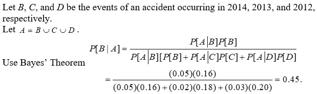

### Bank 2 Question 27

A hospital receives 1/5 of its flu vaccine shipments from Company X and the remainder of its shipments from other companies.  Each shipment contains a very large number of vaccine vials.
 
For Company X’s shipments, 10% of the vials are ineffective.  For every other company, 2% of the vials are ineffective.  The hospital tests 30 randomly selected vials from a shipment and finds that one vial is ineffective.
 
            Calculate the probability that this shipment came from Company X.

- (A) 0.10 **(correct)**
- (B) 0.14
- (C) 0.37
- (D) 0.63
- (E) 0.86

**Solution**

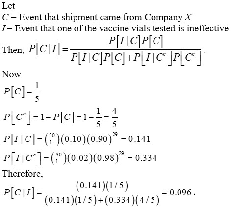

### Bank 2 Question 90

A store has 80 modems in its inventory, 30 coming from Source A and the remainder from Source B.  Of the modems in inventory from Source A, 20% are defective.  Of the modems in inventory from Source B, 8% are defective.
 
Calculate the probability that exactly two out of a sample of five modems selected without replacement from the store’s inventory are defective.

- (A) 0.010
- (B) 0.078
- (C) 0.102 **(correct)**
- (D) 0.105
- (E) 0.125

**Solution**

The number of defective modems is 20% x 30 + 8% x 50 = 10.
The probability that exactly two of a random sample of five are defective is

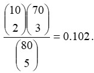

### Bank 2 Question 105

From 27 pieces of luggage, some of which are insured, an airline luggage handler damages a random sample of four.

The probability that exactly one of the damaged pieces of luggage is insured is twice the probability that none of the damaged pieces are insured.

Calculate the probability that exactly two of the four damaged pieces are insured.

- (A) 0.06
- (B) 0.13
- (C) 0.27 **(correct)**
- (D) 0.30
- (E) 0.31

**Solution**

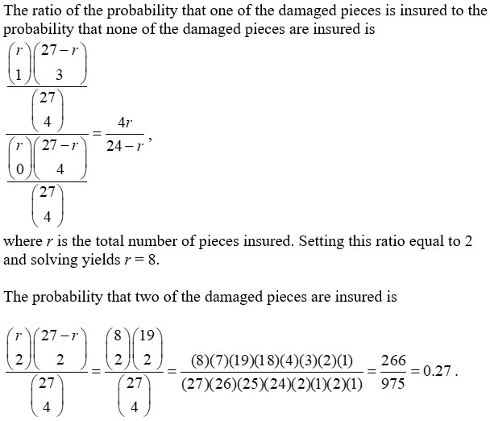

### Bank 2 Question 122

An insurance agent meets twelve potential customers independently, each of whom is equally likely to purchase an insurance product.  Six are interested only in auto insurance, four are interested only in homeowners insurance, and two are interested only in life insurance.
 
The agent makes six sales.
 
Calculate the probability that two are for auto insurance, two are for homeowners insurance, and two are for life insurance.

- (A) 0.001
- (B) 0.024
- (C) 0.069
- (D) 0.097 **(correct)**
- (E) 0.500

**Solution**

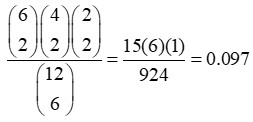

### Bank 2 Question 127

In a group of health insurance policyholders, 20% have high blood pressure and 30% have high cholesterol.  Of the policyholders with high blood pressure, 25% have high cholesterol.
 
A policyholder is randomly selected from the group.
 
Calculate the probability that a policyholder has high blood pressure, given that the policyholder has high cholesterol.

- (A) 1/6 **(correct)**
- (B) 1/5
- (C) 1/4
- (D) 2/3
- (E) 5/6

**Solution**

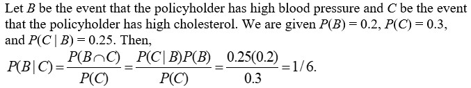

### Bank 2 Question 128

In a group of 25 factory workers, 20 are low-risk and five are high-risk.
 
Two of the 25 factory workers are randomly selected without replacement.
 
Calculate the probability that exactly one of the two selected factory workers is low-risk.

- (A) 0.160
- (B) 0.167
- (C) 0.320
- (D) 0.333 **(correct)**
- (E) 0.633

**Solution**

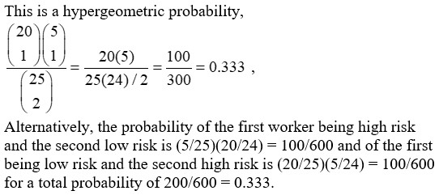

### Bank 2 Question 132

A company issues auto insurance policies.  There are 900 insured individuals.  Fifty-four percent of them are male.  If a female is randomly selected from the 900, the probability she is over 25 years old is 0.43. There are 395 total insured individuals over 25 years old.
 
A person under 25 years old is randomly selected.
 
Calculate the probability that the person selected is male.

- (A) 0.47
- (B) 0.53 **(correct)**
- (C) 0.54
- (D) 0.55
- (E) 0.56

**Solution**

The number of males is 0.54(900) = 486 and of females is then 414.
The number of females over age 25 is 0.43(414) = 178.
The number over age 25 is 395. Therefore the number under age 25 is 505. The number of females under age 25 is 414 – 178 = 236. Therefore the number of males under 25 is 505 – 236 = 269 and the probability is 269/505 =0.533.

### Bank 2 Question 133

An insurance company insures red and green cars. An actuary compiles the following data:

The actuary randomly picks a claim from all claims that exceed the deductible.
 
Calculate the probability that the claim is on a red car.

| Color of car | Red | Green |
|---|---|---|
| Number insured | 300 | 700 |
| Probability an accident occurs | 0.10 | 0.05 |
| Probability that the claim exceeds the deductible, given an accident occurs from this group | 0.90 | 0.80 |

- (A) 0.300
- (B) 0.462
- (C) 0.491 **(correct)**
- (D) 0.667
- (E) 0.692

**Solution**

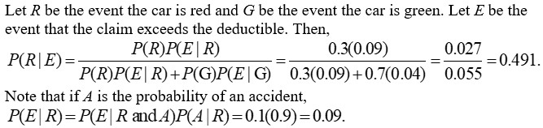

### Bank 2 Question 135

A student takes an examination consisting of 20 true-false questions.  The student knows the answer to *N* of the questions, which are answered correctly, and guesses the answers to the rest.  The conditional probability that the student knows the answer to a question, given that the student answered it correctly, is 0.824..
 
Calculate *N.*

- (A) 8
- (B) 10
- (C) 14 **(correct)**
- (D) 16
- (E) 18

**Solution**

Let *C* and *K* denote respectively the event that the student answers the question correctly and the event that he actually knows the answer. The known probabilities are

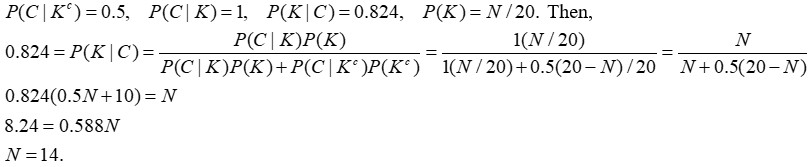

### Bank 2 Question 150

A theme park conducts a study of families that visit the park during a year. The fraction of such families of size *m*
is

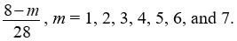

For a family of size *m* that visits the park, the number of members of the family that ride the roller coaster follows a discrete uniform distribution on the set {1, … , *m*}.

Calculate the probability that a family visiting the park has exactly six members, given that exactly five members of the family ride the roller coaster.

- (A) 0.17
- (B) 0.21
- (C) 0.24
- (D) 0.28
- (E) 0.31 **(correct)**

**Solution**

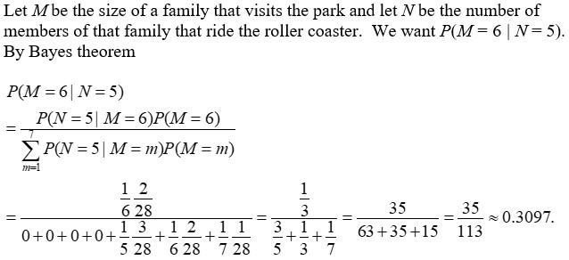

## Sample Exam P Bank 3 - 5 questions

### Bank 3 Question 13

In modeling the number of claims filed by an individual under an automobile policy during a three-year period, an actuary makes the simplifying assumption that for all integers *n* ≥ 0, *p*(*n* + 1) = 0.2*p*(*n*), where *p(n)* represents the probability that the policyholder files *n* claims during the period.

Under this assumption, calculate the probability that a policyholder files more than one claim during the period.

- (A) 0.04 **(correct)**
- (B) 0.16
- (C) 0.20
- (D) 0.80
- (E) 0.96

**Solution**

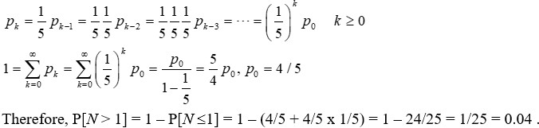

### Bank 3 Question 15

An insurance company determines that *N*, the number of claims received in a week, is a random variable with  where . The company also determines that the number of claims received in a given week is independent of the number of claims received in any other week.

Calculate the probability that exactly seven claims will be received during a given two‑week period.

- (A) 1/256
- (B) 1/128
- (C) 7/512
- (D) 1/64 **(correct)**
- (E) 1/32

**Solution**

Let *N_1* and *N_2* denote the number of claims during weeks one and two, respectively. Then since they are independent,

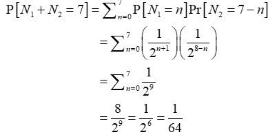

### Bank 3 Question 23

The number of injury claims per month is modeled by a random variable *N* with
, for nonnegative integers, *n*.
Calculate the probability of at least one claim during a particular month, given that there have been at most four claims during that month.

- (A) 1/3
- (B) 2/5 **(correct)**
- (C) 1/2
- (D) 3/5
- (E) 5/6

**Solution**

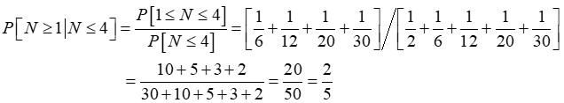

### Bank 3 Question 28

The number of days that elapse between the beginning of a calendar year and the moment a high-risk driver is involved in an accident is exponentially distributed. An insurance company expects that 30% of high-risk drivers will be involved in an accident during the first 50 days of a calendar year.

Calculate the portion of high-risk drivers are expected to be involved in an accident during the first 80 days of a calendar year.

- (A) 0.15
- (B) 0.34
- (C) 0.43 **(correct)**
- (D) 0.57
- (E) 0.66

**Solution**

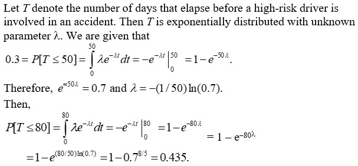

### Bank 3 Question 29

An actuary has discovered that policyholders are three times as likely to file two claims as to file four claims.

The number of claims filed has a Poisson distribution.

Calculate the variance of the number of claims filed.

- (A) 
- (B) 
- (C) 
- (D)  **(correct)**
- (E) 

**Solution**

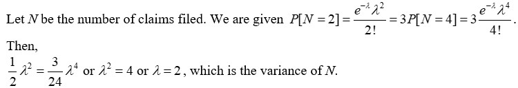

### Bank 3 Question 30

A company establishes a fund of 120 from which it wants to pay an amount, *C*, to any of its 20 employees who achieve a high performance level during the coming year. Each employee has a 2% chance of achieving a high performance level during the coming year. The events of different employees achieving a high performance level during the coming year are mutually independent.

Calculate the maximum value of *C* for which the probability is less than 1% that the fund will be inadequate to cover all payments for high performance.

- (A) 24
- (B) 30
- (C) 40
- (D) 60 **(correct)**
- (E) 120

**Solution**

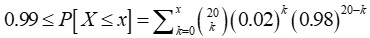

Let *X* denote the number of employees who achieve the high performance level. Then *X* follows a binomial distribution with parameters *n *= 20 and *p* = 0.02. Now we want to determine *x* such that *P*[*X>**x*]<0.01 or equivalently

The first three probabilities (at 0, 1, and 2) are 0.668, 0.272, and 0.053. The total is 0.993 and so the smallest *x* that has the probability exceed 0.99 is 2. Thus *C* = 120/2 = 60.

### Bank 3 Question 31

A large pool of adults earning their first driver’s license includes 50% low-risk drivers, 30% moderate-risk drivers, and 20% high-risk drivers. Because these drivers have no prior driving record, an insurance company considers each driver to be randomly selected from the pool.

This month, the insurance company writes four new policies for adults earning their first driver’s license.

Calculate the probability that these four will contain at least two more high-risk drivers than low-risk drivers.

- (A) 0.006
- (B) 0.012
- (C) 0.018
- (D) 0.049 **(correct)**
- (E) 0.073

**Solution**

Let
*X* = number of low-risk drivers insured
*Y* = number of moderate-risk drivers insured
*Z* = number of high-risk drivers insured
*f*(*x, y, z*) = probability function of *X, Y,* and *Z*
Then *f* is a trinomial probability function, so

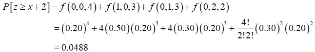

### Bank 3 Question 32

The loss due to a fire in a commercial building is modeled by a random variable *X* with density function

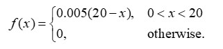

Given that a fire loss exceeds 8, calculate the probability that it exceeds 16.

- (A) 1/25
- (B) 1/9 **(correct)**
- (C) 1/8
- (D) 1/3
- (E) 3/7

**Solution**

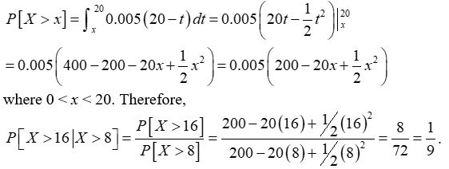

### Bank 3 Question 33

The lifetime of a machine part has a continuous distribution on the interval (0, 40) with probability density function *f*(*x*), where *f*(*x*) is proportional to (10 + x)^- 2 on the interval.

Calculate the probability that the lifetime of the machine part is less than 6.

- (A) 0.04
- (B) 0.15
- (C) 0.47 **(correct)**
- (D) 0.53
- (E) 0.94

**Solution**

### Bank 3 Question 34

A group insurance policy covers the medical claims of the employees of a small company. The value, *V*, of the claims made in one year is described by *V* = 100,000*Y *where *Y* is a random variable with density function

where *k* is a constant.

Calculate the conditional probability that *V* exceeds 40,000, given that *V* exceeds 10,000.

- (A) 0.08
- (B) 0.13 **(correct)**
- (C) 0.17
- (D) 0.20
- (E) 0.51

**Solution**

### Bank 3 Question 35

The lifetime of a printer costing 200 is exponentially distributed with mean 2 years. The manufacturer agrees to pay a full refund to a buyer if the printer fails during the first year following its purchase, a one-half refund if it fails during the second year, and no refund for failure after the second year.

Calculate the expected total amount of refunds from the sale of 100 printers.

- (A) 6,321
- (B) 7,358
- (C) 7,869
- (D) 10,256 **(correct)**
- (E) 12,642

**Solution**

Let *T* denote printer lifetime. The distribution function is *F*(*t*)=1-*e^-*^t*^/2.* The probability of failure in the first year is *F*(1) = 0.3935 and the probability of failure in the second year is *F*(2) – *F*(1) = 0.6321 – 0.3935 = 0.2386. Of 100 printers, the expected number of failures is 39.35 and 23.86 for the two periods. The total expected cost is 200(39.35) + 100(23.86) = 10,256.

### Bank 3 Question 36

An insurance company insures a large number of homes. The insured value, *X*, of a randomly selected home is assumed to follow a distribution with density function

Given that a randomly selected home is insured for at least 1.5, calculate the probability that it is insured for less than 2.

- (A) 0.578 **(correct)**
- (B) 0.684
- (C) 0.704
- (D) 0.829
- (E) 0.875

**Solution**

### Bank 3 Question 37

A company prices its hurricane insurance using the following assumptions:
(i) In any calendar year, there can be at most one hurricane.
(ii) In any calendar year, the probability of a hurricane is 0.05.
(iii) The numbers of hurricanes in different calendar years are mutually independent.

Using the company’s assumptions, calculate the probability that there are fewer than 3 hurricanes in a 20-year period.

- (A) 0.06
- (B) 0.19
- (C) 0.38
- (D) 0.62
- (E) 0.92 **(correct)**

**Solution**

The number of hurricanes has a binomial distribution with *n* = 20 and *p* = 0.05. Then

### Bank 3 Question 38

An insurance policy pays for a random loss *X* subject to a deductible of *C*, where 0 < *C *< 1. The loss amount is modeled as a continuous random variable with density function

Given a random loss *X*, the probability that the insurance payment is less than 0.5 is equal to 0.64.

Calculate *C*.

- (A) 0.1
- (B) 0.3 **(correct)**
- (C) 0.4
- (D) 0.6
- (E) 0.8

**Solution**

### Bank 3 Question 39

A study is being conducted in which the health of two independent groups of ten policyholders is being monitored over a one-year period of time.  Individual participants in the study drop out before the end of the study with probability 0.2 (independently of the other participants).
 
Calculate the probability that at least nine participants complete the study in one of the two groups, but not in both groups?

- (A) 0.096
- (B) 0.192
- (C) 0.235
- (D) 0.376
- (E) 0.469 **(correct)**

**Solution**

The number completing the study in a single group is binomial (10,0.8). For a single group the probability that at least nine complete the study is

The probability that this happens for one group but not the other is 0.376(0.624) + 0.624(0.376) = 0.469.

### Bank 3 Question 41

A company takes out an insurance policy to cover accidents that occur at its manufacturing plant.  The probability that one or more accidents will occur during any given month is 0.60.  The numbers of accidents that occur in different months are mutually independent.
 
Calculate the probability that there will be at least four months in which no accidents occur before the fourth month in which at least one accident occurs.

- (A) 0.01
- (B) 0.12
- (C) 0.23
- (D) 0.29 **(correct)**
- (E) 0.41

**Solution**

### Bank 3 Question 42

An insurance policy pays 100 per day for up to three days of hospitalization and 50 per day for each day of hospitalization thereafter.
 
            The number of days of hospitalization, X, is a discrete random variable with probability function

Determine the expected payment for hospitalization under this policy

- (A) 123
- (B) 210
- (C) 220 **(correct)**
- (D) 270
- (E) 367

**Solution**

The probabilities of 1, 2, 3, 4, and 5 days of hospitalization are 5/15, 4/15, 3/15, 2/15, and 1/15 respectively. The payments are 100, 200, 300, 350, and 400 respectively. The expected value is [100(5) + 200(4) + 300(3) + 350(2) + 400(1)]/15 = 220.

### Bank 3 Question 84

You are given the following information about *N*, the annual number of claims for a randomly selected insured:

Let *S* denote the total annual claim amount for an insured. When *N* = 1, *S* is exponentially distributed with mean 5. When *N* > 1, *S* is exponentially distributed with mean 8.

Calculate P(4 < *S* < 8).

- (A) 0.04
- (B) 0.08
- (C) 0.12 **(correct)**
- (D) 0.24
- (E) 0.25

**Solution**

From the Law of Total Probability:

### Bank 3 Question 85

Under an insurance policy, a maximum of five claims may be filed per year by a policyholder. Let *p*(*n*) be the probability that a policyholder files *n* claims during a given year, where *n *= 0,1,2,3,4,5. An actuary makes the following observations:

Calculate the probability that a random policyholder will file more than three claims during a given year.

- (A) 0.14
- (B) 0.16
- (C) 0.27 **(correct)**
- (D) 0.29
- (E) 0.33

**Solution**

### Bank 3 Question 88

The cumulative distribution function for health care costs experienced by a policyholder is modeled by the function

The policy has a deductible of 20. An insurer reimburses the policyholder for 100% of health care costs between 20 and 120. Health care costs above 120 are reimbursed at 50%.

Let *G* be the cumulative distribution function of reimbursements given that the reimbursement is positive.

Calculate *G*(115).

- (A) 0.683
- (B) 0.727 **(correct)**
- (C) 0.741
- (D) 0.757
- (E) 0.777

**Solution**

### Bank 3 Question 94

A fair die is rolled repeatedly. Let X be the number of rolls needed to obtain a 5 and Y the number of rolls needed to obtain a 6.

:Calculate

- (A) 5.0
- (B) 5.2
- (C) 6.0
- (D) 6.6 **(correct)**
- (E) 6.8

**Solution**

*X* follows a geometric distribution with *p* = 1/6 and *Y* = 2 implies the first roll is not a 6 and the second roll is a 6. This means a 5 is obtained for the first time on the first roll (probability = 0.2) or a 5 is obtained for the first time on the third or later roll (probability = 0.8).

### Bank 3 Question 117

In each of the months June, July, and August, the number of accidents occurring in that month is modeled by a Poisson random variable with mean 1.  In each of the other 9 months of the year, the number of accidents occurring is modeled by a Poisson random variable with mean 0.5.  Assume that these 12 random variables are mutually independent.
 
Calculate the probability that exactly two accidents occur in July through November.

- (A) 0.084
- (B) 0.185 **(correct)**
- (C) 0.251
- (D) 0.257
- (E) 0.271

**Solution**

The months in question have 1, 1, 0.5, 0.5, and 0.5 respectively for their means. The sum of independent Poisson random variables is also Poisson, with the parameters added. So the total number of accidents is Poisson with mean 3.5. The probability of two accidents is

### Bank 3 Question 119

Damages to a car in a crash are modeled by a random variable with density function

where *c* is a constant.

A particular car is insured with a deductible of 2. This car was involved in a crash with resulting damages in excess of the deductible.

Calculate the probability that the damages exceeded 10.

- (A) 0.12
- (B) 0.16
- (C) 0.20
- (D) 0.26 **(correct)**
- (E) 0.78

**Solution**

### Bank 3 Question 124

In a given region, the number of tornadoes in a one-week period is modeled by a Poisson distribution with mean 2.  The numbers of tornadoes in different weeks are mutually independent.
 
Calculate the probability that fewer than four tornadoes occur in a three-week period.

- (A) 0.13
- (B) 0.15 **(correct)**
- (C) 0.29
- (D) 0.43
- (E) 0.86

**Solution**

The sum of independent Poisson variables is also Poisson, with the means added. Thus the number of tornadoes in a three-week period is Poisson with a mean of 3x2 = 6. Then,

### Bank 3 Question 126

An insurance company’s annual profit is normally distributed with mean 100 and variance 400.
 
Let *Z* be normally distributed with mean 0 and variance 1 and let *F *be the cumulative distribution function of *Z*.
 
Determine the probability that the company’s profit in a year is at most 60, given that the profit in the year is positive.

- (A) 1 – *F*(2)
- (B) *F*(2) / *F*(5)
- (C) [1 – *F*(2)] / *F*(5)
- (D) [*F*(0.25) – *F*(0.1)] / *F*(0.25)
- (E) [*F*(5) – *F*(2)] / *F*(5) **(correct)**

**Solution**

### Bank 3 Question 138

Two fair dice are tossed.  One die is red and one die is green.
 
Calculate the probability that the sum of the numbers on the two dice is an odd number given that the number that shows on the red die is larger than the number that shows on the green die.

- (A) 1/4
- (B) 5/12
- (C) 3/7
- (D) 1/2
- (E) 3/5 **(correct)**

**Solution**

Of the 36 possible pairs, there are a total of 15 that have the red number larger than the green number.  Note that a list is not needed.  There are 6 that have equal numbers showing and of the remaining 30 one-half must have red larger than green.  Of these 15, 9 have an odd sum for the answer, 9/15 = 3/5. This is best done by counting, with 3 combinations adding to 7, 2 combinations each totaling 5 and 9, and 1 combination each totaling 3 and 11.

### Bank 3 Question 142

The lifespan, in years, of a certain computer is exponentially distributed. The probability that its lifespan exceeds four years is 0.30. 

Let *f*(*x*) represent the density function of the computer’s lifespan, in years, for *x* > 0. 

Determine which of the following is an expression for* f*(x).

- (A) 
- (B) 
- (C) 
- (D) 
- (E)  **(correct)**

**Solution**

### Bank 3 Question 145

A company has five employees on its health insurance plan.  Each year, each employee independently has an 80% probability of no hospital admissions.  If an employee requires one or more hospital admissions, the number of admissions is modeled by a geometric distribution with a mean of 1.50.  The numbers of hospital admissions of different employees are mutually independent.
 
Each hospital admission costs 20,000.
 
Calculate the probability that the company’s total hospital costs in a year are less than 50,000.

- (A) 0.41
- (B) 0.46
- (C) 0.58
- (D) 0.69
- (E) 0.78 **(correct)**

**Solution**

### Bank 3 Question 146

On any given day, a certain machine has either no malfunctions or exactly one malfunction. The probability of a malfunction on any given day is 0.40. Machine malfunctions on different days are mutually independent.

Calculate the probability that the machine has its third malfunction on the fifth day, given that the machine has not had three malfunctions in the first three days.

- (A) 0.064
- (B) 0.138
- (C) 0.148 **(correct)**
- (D) 0.230
- (E) 0.246

**Solution**

### Bank 3 Question 148

A car is new at the beginning of a calendar year.  The time, in years, before the car experiences its first failure is exponentially distributed with mean 2.
 
Calculate the probability that the car experiences its first failure in the last quarter of some calendar year.

- (A) 0.081
- (B) 0.088
- (C) 0.102
- (D) 0.205 **(correct)**
- (E) 0.250

**Solution**

### Bank 3 Question 149

In a shipment of 20 packages, 7 packages are damaged.  The packages are randomly inspected, one at a time, without replacement, until the fourth damaged package is discovered.
 
Calculate the probability that exactly 12 packages are inspected.

- (A) 0.079
- (B) 0.119 **(correct)**
- (C) 0.237
- (D) 0.243
- (E) 0.358

**Solution**

### Bank 3 Question 158

The number of days an employee is sick each month is modeled by a Poisson distribution with mean 1.  The numbers of sick days in different months are mutually independent.
 
Calculate the probability that an employee is sick more than two days in a three-month period.

- (A) 0.199
- (B) 0.224
- (C) 0.423
- (D) 0.577 **(correct)**
- (E) 0.801

**Solution**

### Bank 3 Question 159

The number of traffic accidents per week at intersection Q has a Poisson distribution with mean 3.  The number of traffic accidents per week at intersection R has a Poisson distribution with mean 1.5.
 
Let *A* be the probability that the number of accidents at intersection Q exceeds its mean. 
Let *B* be the corresponding probability for intersection R.
 
Calculate *B* – *A*.

- (A) 0.00
- (B) 0.09 **(correct)**
- (C) 0.13
- (D) 0.19
- (E) 0.31

**Solution**

### Bank 3 Question 160

Losses due to accidents at an amusement park are exponentially distributed. An insurance company offers the park owner two different policies, with different premiums, to insure against losses due to accidents at the park.
 
Policy A has a deductible of 1.44. For a random loss, the probability is 0.640 that under this policy, the insurer will pay some money to the park owner. Policy B has a deductible of *d*. For a random loss, the probability is 0.512 that under this policy, the insurer will pay some money to the park owner.
 
Calculate *d*.

- (A) 0.960
- (B) 1.152
- (C) 1.728
- (D) 1.800
- (E) 2.160 **(correct)**

**Solution**

### Bank 3 Question 161

The distribution of the size of claims paid under an insurance policy has probability density function

Where *a* > 0 and *c* > 0.

For a randomly selected claim, the probability that the size of the claim is less than 3.75 is 0.4871.

Calculate the probability that the size of a randomly selected claim is greater than 4.

- (A) 0.404
- (B) 0.428 **(correct)**
- (C) 0.500
- (D) 0.572
- (E) 0.596

**Solution**

### Bank 3 Question 179

Four distinct integers are chosen randomly and without replacement from the first twelve positive integers. Let *X* be the random variable representing the second largest of the four selected integers, and let *p *be the probability function for *X*.

Determine *p*(*x*), for integer values of *x*, where *p*(*x*) > 0.

- (A)  **(correct)**
- (B) 
- (C) 
- (D) 
- (E) 

**Solution**

### Bank 3 Question 200

The number of traffic accidents occurring on any given day in Coralville is Poisson distributed with mean 5.  The probability that any such accident involves an uninsured driver is 0.25, independent of all other such accidents.
 
Calculate the probability that on a given day in Coralville there are no traffic accidents that involve an uninsured driver.

- (A) 0.007
- (B) 0.010
- (C) 0.124
- (D) 0.237
- (E) 0.287 **(correct)**

**Solution**

### Bank 3 Question 201

A group of 100 patients is tested, one patient at a time, for three risk factors for a certain disease until either all patients have been tested or a patient tests positive for more than one of these three risk factors. For each risk factor, a patient tests positive with probability *p*, where 0 < *p* < 1. The outcomes of the tests across all patients and all risk factors are mutually independent.

Determine an expression for the probability that exactly n patients are tested, where *n* is a positive integer less than 100.

- (A) [1–3*p*^2(1–*p*)]^*n*-1[3*p*^2(1–*p*)]
- (B) [1–3*p*^2(1–*p*)–*p*^3]^*n*-1[3*p*^2(1–*p*)+*p*^3] **(correct)**
- (C) [1–3*p*^2(1–*p*)–*p*^3][3*p*^2(1–*p*)+*p*^3]^*n*–1
- (D) *n*[1–3*p*^2(1–*p)*–*p*^3]^*n*–1[3*p*^2(1–*p*)+*p*^3]
- (E) 3[(1–*p*)^*n*–1*p*]^2[1–(1–*p*)^*n*–1*p*]+[(1–*p*)^*n*–1*p*]^3

**Solution**

## Sample Exam P Bank 4 - 6 questions

### Bank 4 Question 43

Let *X* be a continuous random variable with density function

Calculate the expected value of *X*.

- (A) 1/5
- (B) 3/5
- (C) 1
- (D) 28/15 **(correct)**
- (E) 12/5

**Solution**

### Bank 4 Question 44

A device that continuously measures and records seismic activity is placed in a remote region. The time, *T*, to failure of this device is exponentially distributed with mean 3 years. Since the device will not be monitored during its first two years of service, the time to discovery of its failure is *X* = max(*T*, 2).

Calculate *E*(*X*).

- (A) 
- (B) 
- (C) 
- (D)  **(correct)**
- (E) 

**Solution**

### Bank 4 Question 45

A piece of equipment is being insured against early failure. The time from purchase until failure of the equipment is exponentially distributed with mean 10 years. The insurance will pay an amount *x* if the equipment fails during the first year, and it will pay 0.5*x* if failure occurs during the second or third year. If failure occurs after the first three years, no payment will be made.

Calculate *x* such that the expected payment made under this insurance is 1000.

- (A) 3858
- (B) 4449
- (C) 5382
- (D) 5644 **(correct)**
- (E) 7235

**Solution**

### Bank 4 Question 46

An insurance policy on an electrical device pays a benefit of 4000 if the device fails during the first year. The amount of the benefit decreases by 1000 each successive year until it reaches 0. If the device has not failed by the beginning of any given year, the probability of failure during that year is 0.4.

Calculate the expected benefit under this policy.

- (A) 2234
- (B) 2400
- (C) 2500
- (D) 2667
- (E) 2694 **(correct)**

**Solution**

### Bank 4 Question 47

A company buys a policy to insure its revenue in the event of major snowstorms that shut down business. The policy pays nothing for the first such snowstorm of the year and 10,000 for each one thereafter, until the end of the year. The number of major snowstorms per year that shut down business is assumed to have a Poisson distribution with mean 1.5.

Calculate the expected amount paid to the company under this policy during a one-year period.

- (A) 2,769
- (B) 5,000
- (C) 7,231 **(correct)**
- (D) 8,347
- (E) 10,578

**Solution**

### Bank 4 Question 48

A manufacturer’s annual losses follow a distribution with density function

To cover its losses, the manufacturer purchases an insurance policy with an annual deductible of 2.
 
Calculate the mean of the manufacturer’s annual losses not paid by the insurance policy.

- (A) 0.84
- (B) 0.88
- (C) 0.93 **(correct)**
- (D) 0.95
- (E) 1.00

**Solution**

### Bank 4 Question 49

An insurance company sells a one-year automobile policy with a deductible of 2. The probability that the insured will incur a loss is 0.05. If there is a loss, the probability of a loss of amount *N* is *K/N*, for *N* = 1, . . . , 5 and *K* a constant. These are the only possible loss amounts and no more than one loss can occur.

Calculate the expected payment for this policy.

- (A) 0.031 **(correct)**
- (B) 0.066
- (C) 0.072
- (D) 0.110
- (E) 0.150

**Solution**

### Bank 4 Question 50

An insurance policy reimburses a loss up to a benefit limit of 10. The policyholder’s loss, *Y,* follows a distribution with density function:

Calculate the expected value of the benefit paid under the insurance policy.

- (A) 1.0
- (B) 1.3
- (C) 1.8
- (D) 1.9 **(correct)**
- (E) 2.0

**Solution**

### Bank 4 Question 51

An auto insurance company insures an automobile worth 15,000 for one year under a policy with a 1,000 deductible. During the policy year there is a 0.04 chance of partial damage to the car and a 0.02 chance of a total loss of the car. If there is partial damage to the car, the amount *X* of damage (in thousands) follows a distribution with density function

Calculate the expected claim payment.

- (A) 320
- (B) 328 **(correct)**
- (C) 352
- (D) 380
- (E) 540

**Solution**

### Bank 4 Question 52

An insurance company’s monthly claims are modeled by a continuous, positive random variable *X*, whose probability density function is proportional to , for .
Calculate the company’s expected monthly claims.

- (A) 1/6
- (B) 1/3
- (C) 1/2 **(correct)**
- (D) 1
- (E) 3

**Solution**

### Bank 4 Question 53

An insurance policy is written to cover a loss, *X*, where *X* has a uniform distribution on [0, 1000]. The policy has a deductible, *d*, and the expected payment under the policy is 25% of what it would be with no deductible.

Calculate *d*.

- (A) 250
- (B) 375
- (C) 500 **(correct)**
- (D) 625
- (E) 750

**Solution**

### Bank 4 Question 54

An insurer's annual weather-related loss, *X*, is a random variable with density function

Calculate the difference between the 30th and 70th percentiles of *X*.

- (A) 35
- (B) 93 **(correct)**
- (C) 124
- (D) 231
- (E) 298

**Solution**

### Bank 4 Question 55

A recent study indicates that the annual cost of maintaining and repairing a car in a town in Ontario averages 200 with a variance of 260.
 
A tax of 20% is introduced on all items associated with the maintenance and repair of cars (i.e., everything is made 20% more expensive).
 
Calculate the variance of the annual cost of maintaining and repairing a car after the tax is introduced.

- (A) 208
- (B) 260
- (C) 270
- (D) 312
- (E) 374 **(correct)**

**Solution**

Let *X* and *Y* denote the annual cost of maintaining and repairing a car before and after the 20% tax, respectively. Then *Y* = 1.2*X* and 
*Var*(*Y*)=Var(1.2*X*)=1.44Var(*X*)=1.44(260)=374.4.

### Bank 4 Question 56

A random variable *X* has the cumulative distribution function

Calculate the variance of *X*.

- (A) 7/72
- (B) 1/8
- (C) 5/36 **(correct)**
- (D) 4/3
- (E) 23/12

**Solution**

First note that the distribution function jumps ½ at *x* = 1, so there is discrete probability at that point. From 1 to 2, the density function is the derivative of the distribution function, *x* – 1. Then,

### Bank 4 Question 57

The warranty on a machine specifies that it will be replaced at failure or age 4, whichever occurs first. The machine’s age at failure, *X*, has density function

Let *Y* be the age of the machine at the time of replacement.

Calculate the variance of *Y*.

- (A) 1.3
- (B) 1.4
- (C) 1.7 **(correct)**
- (D) 2.1
- (E) 7.5

**Solution**

### Bank 4 Question 58

A probability distribution of the claim sizes for an auto insurance policy is given in the table below:

Calculate the percentage of claims that are within one standard deviation of the mean claim size.

| Claim Size | Probability |
|---|---|
| 20 | 0.15 |
| 30 | 0.10 |
| 40 | 0.05 |
| 50 | 0.20 |
| 60 | 0.10 |
| 70 | 0.10 |
| 80 | 0.30 |

- (A) 45% **(correct)**
- (B) 55%
- (C) 68%
- (D) 85%
- (E) 100%

**Solution**

The mean is 20(0.15) + 30(0.10) + 40(0.05) + 50(0.20) + 60(0.10) + 70(0.10) + 80(0.30) = 55. The second moment is 400(0.15) + 900(0.10) + 1600(0.05) + 2500(0.20) + 3600(0.10) + 4900(0.10) + 6400(0.30) = 3500. The variance is 3500 – 55^2 = 475. The standard deviation is 21.79. The range within one standard deviation of the mean is 33.21 to 76.79, which includes the values 40, 50, 60, and 70. The sum of the probabilities for those values is 0.05 + 0.20 + 0.10 + 0.10 = 0.45.

### Bank 4 Question 59

The owner of an automobile insures it against damage by purchasing an insurance policy with a deductible of 250.  In the event that the automobile is damaged, repair costs can be modeled by a uniform random variable on the interval (0, 1500).
 
            Calculate the standard deviation of the insurance payment in the event that the automobile is damaged.

- (A) 361
- (B) 403 **(correct)**
- (C) 433
- (D) 464
- (E) 521

**Solution**

Let *Y* be the amount of the insurance payment.

### Bank 4 Question 60

A baseball team has scheduled its opening game for April 1.  If it rains on April 1, the game is postponed and will be played on the next day that it does not rain.  The team purchases insurance against rain.  The policy will pay 1000 for each day, up to 2 days, that the opening game is postponed. 
 
            The insurance company determines that the number of consecutive days of rain beginning on April 1 is a Poisson random variable with mean 0.6.
 
            Calculate the standard deviation of the amount the insurance company will have to pay.

- (A) 668
- (B) 699 **(correct)**
- (C) 775
- (D) 817
- (E) 904

**Solution**

### Bank 4 Question 61

An insurance policy reimburses dental expense, *X*, up to a maximum benefit of 250.  The probability density function for *X* is:

where *c* is a constant.
 
Calculate the median benefit for this policy.

- (A) 161
- (B) 165
- (C) 173 **(correct)**
- (D) 182
- (E) 250

**Solution**

### Bank 4 Question 62

The time to failure of a component in an electronic device has an exponential distribution with a median of four hours.
 
            Calculate the probability that the component will work without failing for at least five hours.

- (A) 0.07
- (B) 0.29
- (C) 0.38
- (D) 0.42 **(correct)**
- (E) 0.57

**Solution**

### Bank 4 Question 63

An insurance company sells an auto insurance policy that covers losses incurred by a policyholder, subject to a deductible of 100. Losses incurred follow an exponential distribution with mean 300.

Calculate the 95^th percentile of losses that exceed the deductible.

- (A) 600
- (B) 700
- (C) 800
- (D) 900
- (E) 1000 **(correct)**

**Solution**

This is a conditional probability. The solution is

### Bank 4 Question 74

A tour operator has a bus that can accommodate 20 tourists.  The operator knows that tourists may not show up, so he sells 21 tickets.  The probability that an individual tourist will not show up is 0.02, independent of all other tourists.
 
Each ticket costs 50, and is non-refundable if a tourist fails to show up.  If a tourist shows up and a seat is not available, the tour operator has to pay 100 (ticket cost + 50 penalty) to the tourist.
 
Calculate the expected revenue of the tour operator.

- (A) 955
- (B) 962
- (C) 967
- (D) 976
- (E) 985 **(correct)**

**Solution**

The tour operator collects 21 x 50 = 1050 for the 21 tickets sold. The probability that all 21 passengers will show up is (1 - 0.02)^21 = (0.98)^21 = 0.65. Therefore, the tour operator’s expected revenue is 1050 – 100(0.65) = 985.

### Bank 4 Question 89

Let *N*_1 and *N*_2 represent the numbers of claims submitted to a life insurance company in April and May, respectively.  The joint probability function of *N*1 and *N*_2 is

Calculate the expected number of claims that will be submitted to the company in May, given that exactly 2 claims were submitted in April.

- (A)  **(correct)**
- (B) 
- (C) 
- (D) 
- (E) 

**Solution**

### Bank 4 Question 91

A man purchases a life insurance policy on his 40th birthday. The policy will pay 5000 if he dies before his 50^th birthday and will pay 0 otherwise. The length of lifetime, in years from birth, of a male born the same year as the insured has the cumulative distribution function

Calculate the expected payment under this policy.

- (A) 333
- (B) 348 **(correct)**
- (C) 421
- (D) 549
- (E) 574

**Solution**

### Bank 4 Question 96

Each time a hurricane arrives, a new home has a 0.4 probability of experiencing damage.  The occurrences of damage in different hurricanes are mutually independent.
 
Calculate the mode of the number of hurricanes it takes for the home to experience damage from two hurricanes.

- (A) 2
- (B) 3 **(correct)**
- (C) 4
- (D) 5
- (E) 6

**Solution**

### Bank 4 Question 98

An auto insurance company is implementing a new bonus system. In each month, if a policyholder does not have an accident, he or she will receive a cash-back bonus of 5 from the insurer.
 
Among the 1,000 policyholders of the auto insurance company, 400 are classified as low-risk drivers and 600 are classified as high-risk drivers.
 
In each month, the probability of zero accidents for high-risk drivers is 0.80 and the probability of zero accidents for low-risk drivers is 0.90.
 
Calculate the expected bonus payment from the insurer to the 1000 policyholders in one year.

- (A) 48,000
- (B) 50,400 **(correct)**
- (C) 51,000
- (D) 54,000
- (E) 60,000

**Solution**

The expected bonus for a high-risk driver is 0.8(12)(5) = 48.
The expected bonus for a low-risk driver is 0.9(12)(5) = 54.
The expected bonus payment from the insurer is 600(48) + 400(54) = 50,400.

### Bank 4 Question 101

The amount of a claim that a car insurance company pays out follows an exponential distribution. By imposing a deductible of *d*, the insurance company reduces the expected claim payment by 10%.

Calculate the percentage reduction on the variance of the claim payment.

- (A) 1% **(correct)**
- (B) 5%
- (C) 10%
- (D) 20%
- (E) 25%

**Solution**

### Bank 4 Question 109

Automobile claim amounts are modeled by a uniform distribution on the interval [0, 10,000]. Actuary A reports *X*, the claim amount divided by 1000. Actuary B reports *Y*, which is *X* rounded to the nearest integer from 0 to 10.

Calculate the absolute value of the difference between the 4^th moment of *X* and the 4th moment of *Y*.

- (A) 0
- (B) 33 **(correct)**
- (C) 296
- (D) 303
- (E) 533

**Solution**

### Bank 4 Question 111

Let X be a continuous random variable with density function

Calculate the value of *p* such that *E*(*X*) = 2.

- (A) 1
- (B) 2.5
- (C) 3 **(correct)**
- (D) 5
- (E) There is no such *p*.

**Solution**

### Bank 4 Question 112

The figure below shows the cumulative distribution function of a random variable, *X*.

Calculate *E*(*X*).

- (A) 0.00
- (B) 0.50
- (C) 1.00
- (D) 1.25 **(correct)**
- (E) 2.50

**Solution**

The distribution function plot shows that *X* has a point mass at 0 with probability 0.5. From 2 to 3 it has a continuous distribution. The density function is the derivative, which is the constant (1 – 0.5)/(3 – 2) = 0.5. The expected value is 0(0.5) plus the integral from 2 to 3 of 0.5*x*. The integral evaluates to 1.25, which is the answer. Alternatively, this is a 50-50 mixture of a point mass at 0 and a uniform(2,3) distribution. The mean is 0.5(0) + 0.5(2.5) = 1.25.

### Bank 4 Question 129

The proportion *X* of yearly dental claims that exceed 200 is a random variable with probability density function

Calculate Var[*X*/(1 – *X*)]

- (A) 149/900
- (B) 10/7
- (C) 6 **(correct)**
- (D) 8
- (E) 10

**Solution**

### Bank 4 Question 137

The number of policies that an agent sells has a Poisson distribution with modes at 2 and 3.
 
*K* is the smallest number such that the probability of selling more than *K* policies is less than 25%. 
 
Calculate *K*.

- (A) 1
- (B) 2
- (C) 3
- (D) 4 **(correct)**
- (E) 5

**Solution**

Because the mode is 2 and 3, the parameter is 3 (when the parameter is a whole number the probabilities at the parameter and at one less than the parameter are always equal).  Alternatively, the equation *p*(2) = *p*(3) can be solved for the parameter.  Then the probability of selling 4 or fewer policies is 0.815 and this is the first such probability that exceeds 0.75.  Thus, 4 is the first number for which the probability of selling more than that number of policies is less than 0.25.

### Bank 4 Question 139

Math SAT scores are normally distributed and when reported are rounded to multiples of ten.
 
In 1982 Abby’s mother scored at the rounded 93rd percentile on the math SAT exam.  In 1982 the mean score was 503 and the variance of the scores was 9604.
 
In 2008 Abby took the math SAT and got the same rounded numerical score as her mother had received 26 years before.  In 2008 the mean score was 521 and the variance of the scores was 10,201.
  
Calculate the percentile corresponding to Abby’s rounded score.

- (A) 89^th
- (B) 90^th **(correct)**
- (C) 91^st
- (D) 92^nd
- (E) 93^rd

**Solution**

From the table the exact 93rd percentile comes from a z-score between 1.47 and 1.48.  1.47 implies a test score of 503 + 1.47(98) = 647.1. Similarly, 1.48 implies a score of 648.0.  The closest multiple of 10 is 650.  Abby’s z-score is then (650 – 521)/101 = 1.277.  This rounds to the 90th percentile of the standard normal distribution.

### Bank 4 Question 143

The lifetime of a light bulb has density function, *f,* where *f*(*x*) is proportional to

Calculate the mode of this distribution.

- (A) 0.00
- (B) 0.79
- (C) 1.26 **(correct)**
- (D) 4.42
- (E) 5.00

**Solution**

It is not necessary to determine the constant of proportionality.  Let it be *c*. To determine the mode, set the derivative of the density function equal to zero and solve.

### Bank 4 Question 144

An insurer’s medical reimbursements have density function *f*, where *f*(*x*) is proportional to

Calculate the mode of the medical reimbursements.

- (A) 0.00
- (B) 0.50
- (C) 0.71 **(correct)**
- (D) 0.84
- (E) 1.00

**Solution**

It is not necessary to determine the constant of proportionality.  Let it be *c*. To determine the mode, set the derivative of the density function equal to zero and solve.

### Bank 4 Question 162

Company XYZ provides a warranty on a product that it produces.  Each year, the number of warranty claims follows a Poisson distribution with mean *c*.  The probability that no warranty claims are received in any given year is 0.60.
 
Company XYZ purchases an insurance policy that will reduce its overall warranty claim payment costs.  The insurance policy will pay nothing for the first warranty claim received and 5000 for each claim thereafter until the end of the year.
 
Calculate the expected amount of annual insurance policy payments to Company XYZ.

- (A) 554 **(correct)**
- (B) 872
- (C) 1022
- (D) 1354
- (E) 1612

**Solution**

### Bank 4 Question 164

The working lifetime, in years, of a particular model of bread maker is normally distributed with mean 10 and variance 4.
 
Calculate the 12^th percentile of the working lifetime, in years.

- (A) 5.30
- (B) 7.65 **(correct)**
- (C) 8.41
- (D) 12.35
- (E) 14.70

**Solution**

Let *X* be normal with mean 10 and variance 4.  Let *Z* have the standard normal distribution.  Let p = 12th percentile. Then

### Bank 4 Question 165

The profits of life insurance companies A and B are normally distributed with the same mean.  The variance of company B's profit is 2.25 times the variance of company A's profit.  The 14th percentile of company A’s profit is the same as the *p*^th percentile of company B’s profit.
 
Calculate *p*.

- (A) 5.3
- (B) 9.3
- (C) 21.0
- (D) 23.6 **(correct)**
- (E) 31.6

**Solution**

### Bank 4 Question 166

The distribution of values of the retirement package offered by a company to new employees is modeled by the probability density function

Calculate the variance of the retirement package value for a new employee, given that the value is at least 10.

- (A) 15
- (B) 20
- (C) 25 **(correct)**
- (D) 30
- (E) 35

**Solution**

### Bank 4 Question 167

Insurance companies A and B each earn an annual profit that is normally distributed with the same positive mean.  The standard deviation of company A’s annual profit is one half of its mean.
 
In a given year, the probability that company B has a loss (negative profit) is 0.9 times the probability that company A has a loss.
 
Calculate the ratio of the standard deviation of company B’s annual profit to the standard deviation of company A’s annual profit.

- (A) 0.49
- (B) 0.90
- (C) 0.98 **(correct)**
- (D) 1.11
- (E) 1.71

**Solution**

## Sample Exam P Bank 5 - 2 questions

### Bank 5 Question 115

An auto insurance policy has a deductible of 1 and a maximum claim payment of 5. Auto loss amounts follow an exponential distribution with mean 2.

Calculate the expected claim payment made for an auto loss.

- (A) 
- (B) 
- (C)  **(correct)**
- (D) 
- (E) 

**Solution**

### Bank 5 Question 118

An airport purchases an insurance policy to offset costs associated with excessive amounts of snowfall. For every full ten inches of snow in excess of 40 inches during the winter season, the insurer pays the airport 300 up to a policy maximum of 700. The following table shows the probability function for the random variable *X* of annual (winter season) snowfall, in inches, at the airport.

Calculate the standard deviation of the amount paid under the policy.

- (A) 134
- (B) 235 **(correct)**
- (C) 271
- (D) 313
- (E) 352

**Solution**

The payments are 0 with probability 0.72 (snowfall up to 50 inches), 300 with probability 0.14, 600 with probability 0.06, and 700 with probability 0.08. The mean is 0.72(0) + 0.14(300) + 0.06(600) + 0.08(700) = 134 and the second moment is 0.72(0^2) + 0.14(300^2) + 0.06(600^2) + 0.08(700^2) = 73,400. The variance is 73,400 – 134^2 = 55,444. The standard deviation is the square root, 235.

### Bank 5 Question 141

Losses covered by a flood insurance policy are uniformly distributed on the interval
[0, 2].  The insurer pays the amount of the loss in excess of a deductible *d*.
 
The probability that the insurer pays at least 1.20 on a random loss is 0.30.
 
Calculate the probability that the insurer pays at least 1.44 on a random loss.

- (A) 0.06
- (B) 0.16
- (C) 0.18 **(correct)**
- (D) 0.20
- (E) 0.28

**Solution**

### Bank 5 Question 152

An insurance company issues policies covering damage to automobiles. The amount of damage is modeled by a uniform distribution on [0, *b*]. 

The policy payout is subject to a deductible of *b*/10.

A policyholder experiences automobile damage.

Calculate the ratio of the standard deviation of the policy payout to the standard deviation of the amount of the damage.

- (A) 0.8100
- (B) 0.9000
- (C) 0.9477
- (D) 0.9487
- (E) 0.9735 **(correct)**

**Solution**

### Bank 5 Question 155

A policy covers a gas furnace for one year. During that year, only one of three problems can occur:

i) The igniter switch may need to be replaced at a cost of 60. There is a 0.10 probability of this.
ii) The pilot light may need to be replaced at a cost of 200. There is a 0.05 probability of this.
iii) The furnace may need to be replaced at a cost of 3000. There is a 0.01 probability of this.

Calculate the deductible that would produce an expected claim payment of 30.

- (A) Less than or equal to 100
- (B) Greater than 100 but less than or equal to 150
- (C) Greater than 150 but less than or equal to 200 **(correct)**
- (D) Greater than 200 but less than or equal to 250
- (E) Greater than 250

**Solution**

### Bank 5 Question 163

For a certain health insurance policy, losses are uniformly distributed on the interval
[0, *b*].  The policy has a deductible of 180 and the expected value of the unreimbursed portion of a loss is 144.
 
Calculate *b*.

- (A) 236
- (B) 288
- (C) 388
- (D) 450 **(correct)**
- (E) 468

**Solution**

### Bank 5 Question 181

Losses covered by an insurance policy are modeled by a uniform distribution on the interval [0, 1000].  An insurance company reimburses losses in excess of a deductible of 250.
 
Calculate the difference between the median and the 20^th percentile of the insurance company reimbursement, over all losses.

- (A) 225
- (B) 250 **(correct)**
- (C) 300
- (D) 375
- (E) 500

**Solution**

Before applying the deductible, the median is 500 and the 20^th percentile is 200. After applying the deductible, the median payment is 500 – 250 = 250 and the 20^th percentile is max(0, 200 – 250) = 0. The difference is 250.

### Bank 5 Question 215

Losses under an insurance policy are exponentially distributed with mean 4.  The deductible is 1 for each loss.
 
Calculate the median amount that the insurer pays a policyholder for a loss under the policy.

- (A) 1.77 **(correct)**
- (B) 2.08
- (C) 2.12
- (D) 2.77
- (E) 3.12

**Solution**

### Bank 5 Question 219

For a certain health insurance policy, losses are uniformly distributed on the interval
[0, 450].  The policy has a deductible of d and the expected value of the unreimbursed portion of a loss is 56.
 
Calculate *d*.

- (A) 60 **(correct)**
- (B) 87
- (C) 112
- (D) 169
- (E) 224

**Solution**

The expected unreimbursed loss is

### Bank 5 Question 222

Losses incurred by a policyholder follow a normal distribution with mean 20,000 and standard deviation 4,500.  The policy covers losses, subject to a deductible of 15,000. 
 
Calculate the 95^th percentile of losses that exceed the deductible.

- (A) 27,400
- (B) 27,700 **(correct)**
- (C) 28,100
- (D) 28,400
- (E) 28,800

**Solution**

### Bank 5 Question 226

Losses, *X*, under an insurance policy are exponentially distributed with mean 10. For each loss, the claim payment *Y* is equal to equal to the maximum of *X* – *d* (*d* > 0) and 0.

- (A) 
- (B) 
- (C) 
- (D)  **(correct)**
- (E) 

**Solution**

### Bank 5 Question 229

A government employee’s yearly dental expense follows a uniform distribution on the interval from 200 to 1200.  The government’s primary dental plan reimburses an employee for up to 400 of dental expense incurred in a year, while a supplemental plan pays up to 500 of any remaining dental expense.
 
Let *Y* represent the yearly benefit paid by the supplemental plan to a government employee.
 
Calculate Var(*Y*).

- (A) 20,833
- (B) 26,042
- (C) 41,042 **(correct)**
- (D) 53,333
- (E) 83,333

**Solution**

### Bank 5 Question 230

Under a liability insurance policy, losses are uniformly distributed on [0, *b*], where *b* is a positive constant.  There is a deductible of *b*/2.
 
Calculate the ratio of the variance of the claim payment (greater than or equal to zero) from a given loss to the variance of the loss.

- (A) 1:8
- (B) 3:16
- (C) 1:4
- (D) 5:16 **(correct)**
- (E) 1:2

**Solution**

## Sample Exam P Bank 6 - 2 questions

### Bank 6 Question 73

The waiting time for the first claim from a good driver and the waiting time for the first claim from a bad driver are independent and follow exponential distributions with means 6 years and 3 years, respectively.

Calculate the probability that the first claim from a good driver will be filed within 3 years and the first claim from a bad driver will be filed within 2 years.

- (A) 
- (B) 
- (C)  **(correct)**
- (D) 
- (E) 

**Solution**

### Bank 6 Question 95

A driver and a passenger are in a car accident. Each of them independently has probability 0.3 of being hospitalized. When a hospitalization occurs, the loss is uniformly distributed on [0, 1]. When two hospitalizations occur, the losses are independent.

Calculate the expected number of people in the car who are hospitalized, given that the total loss due to hospitalizations from the accident is less than 1.

- (A) 0.510
- (B) 0.534 **(correct)**
- (C) 0.600
- (D) 0.628
- (E) 0.800

**Solution**

The unconditional probabilities for the number of people in the car who are hospitalized are 0.49, 0.42 and 0.09 for 0, 1 and 2, respectively. If the number of people hospitalized is 0 or 1, then the total loss will be less than 1. However, if two people are hospitalized, the probability that the total loss will be less than 1 is 0.5. Thus, the expected number of people in the car who are hospitalized, given that the total loss due to hospitalizations from the accident is less than 1 is

### Bank 6 Question 104

An automobile insurance company issues a one-year policy with a deductible of 500. The probability is 0.8 that the insured automobile has no accident and 0.0 that the automobile has more than one accident. If there is an accident, the loss before application of the deductible is exponentially distributed with mean 3000.

Calculate the 95th percentile of the insurance company payout on this policy.

- (A) 3466
- (B) 3659 **(correct)**
- (C) 4159
- (D) 8487
- (E) 8987

**Solution**

### Bank 6 Question 106

Automobile policies are separated into two groups: low-risk and high-risk. Actuary Rahul examines low-risk policies, continuing until a policy with a claim is found and then stopping. Actuary Toby follows the same procedure with high-risk policies. Each low-risk policy has a 10% probability of having a claim. Each high-risk policy has a 20% probability of having a claim. The claim statuses of polices are mutually independent.

Calculate the probability that Actuary Rahul examines fewer policies than Actuary Toby.

- (A) 0.2857 **(correct)**
- (B) 0.3214
- (C) 0.3333
- (D) 0.3571
- (E) 0.4000

**Solution**

### Bank 6 Question 110

The probability of *x* losses occurring in year 1 is (0.5)*x*+1 for *x *= 0, 1, 2, ...

The probability of *y* losses in year 2 given *x* losses in year 1 is given by the table:

Calculate the probability of exactly 2 losses in 2 years.

- (A) 0.025
- (B) 0.031
- (C) 0.075
- (D) 0.100
- (E) 0.131 **(correct)**

**Solution**

### Bank 6 Question 238

Skateboarders A and B practice one difficult stunt until becoming injured while attempting the stunt.  On each attempt, the probability of becoming injured is *p*, independent of the outcomes of all previous attempts.
 
Let *F*(*x, y*) represent the probability that skateboarders A and B make no more than *x* and *y* attempts, respectively, where *x* and *y* are positive integers.
 
It is given that *F*(2, 2) = 0.0441.
 
Calculate *F*(1, 5).

- (A) 0.0093
- (B) 0.0216
- (C) 0.0495 **(correct)**
- (D) 0.0551
- (E) 0.1112

**Solution**

### Bank 6 Question 239

The number of minor surgeries, *X*, and the number of major surgeries, *Y,* for a policyholder, this decade, has joint cumulative distribution function

for nonnegative integers *x* and *y.*

Calculate the probability that the policyholder experiences exactly three minor surgeries and exactly three major surgeries this decade.

- (A) 0.00004
- (B) 0.00040 **(correct)**
- (C) 0.03244
- (D) 0.06800
- (E) 0.12440

**Solution**

### Bank 6 Question 305

A company administers a typing test to screen applicants for a secretarial position. In order to pass the test, an applicant must complete the test in 50 minutes with no more than one error. Historical data reveals the following about the population of applicants:
i) The number of test errors follows a Poisson distribution with mean 3.
ii) The time required to complete the test follows a normal distribution with mean 45 and standard deviation 10.
iii) The number of errors and the time required to complete the test are independent.

Calculate the probability that an applicant chosen at random will pass the test.

- (A) 0.10
- (B) 0.14 **(correct)**
- (C) 0.19
- (D) 0.84
- (E) 0.89

**Solution**

### Bank 6 Question 400

An insurance policy provides coverage for two types of claims.  Let *X* and *Y* denote the numbers of monthly claims of Type I and Type II, respectively.  The joint probability function of *X* and *Y* is given by

Calculate the probability that there are in total at least two claims on this policy in the coming month.

- (A) 0.19
- (B) 0.28
- (C) 0.39
- (D) 0.52
- (E) 0.61 **(correct)**

**Solution**

Let *W* denote the total claims received.

### Bank 6 Question 410

This year, a homeowner experiences no tornadoes with probability 0.80, exactly one tornado with probability 0.12, exactly two tornadoes with probability 0.05, and exactly three tornadoes with probability 0.03.

Each tornado independently results in a loss of 1 with probability 0.50 and a loss of 2 with probability 0.50.

Let *X* be the number of tornadoes that the homeowner experiences this year, and *Y* be the total amount of losses that the homeowner experiences this year due to all the tornadoes. Let *F*(*x,y*) be the joint cumulative distribution function of *X* and *Y*.

Calculate *F*(2,3).

- (A) 0.0250
- (B) 0.0500
- (C) 0.0675
- (D) 0.9325
- (E) 0.9575 **(correct)**

**Solution**

### Bank 6 Question 449

Two random variables *X* and *Y* are each defined on a set of positive integers and have joint probability function *p*(*x,y*). A portion of the corresponding joint cumulative distribution function *F*(*x,y*) is given in the following table:

Calculate *p*(4,9) + *p*(5,9).

- (A) 0.01
- (B) 0.02
- (C) 0.03
- (D) 0.04
- (E) 0.05 **(correct)**

**Solution**

### Bank 6 Question 457

Let *X* denote the number of illnesses a person experiences during a one-year period. The probability function of *X* is:

If *X* = 0, then the person makes no doctor visits during the one-year period. If *X* = *k*, for *k* = 1, 2, 3, then the number of doctor visits is Poisson distributed with mean *k*.

Calculate the probability that the person makes at least one doctor visit during the one-year period.

- (A) 0.18
- (B) 0.39
- (C) 0.61 **(correct)**
- (D) 0.72
- (E) 0.89

**Solution**

### Bank 6 Question 476

An insurer sells an annual group life and disability policy. The joint probability distribution for death and disability is:

Calculate the probability of at least two disabilities, given no more than one death.

- (A) 0.14
- (B) 0.17
- (C) 0.18
- (D) 0.21 **(correct)**
- (E) 0.32

**Solution**

Add the probabilities for number of deaths less than 2.  Add the probabilities for number of deaths less than 2 and number of disabilities at least 2.  Divide second sum by first sum.

## Sample Exam P Bank 7 - 3 questions

### Bank 7 Question 17

Two instruments are used to measure the height, *h*, of a tower. The error made by the less accurate instrument is normally distributed with mean 0 and standard deviation 0.0056*h*. The error made by the more accurate instrument is normally distributed with mean 0 and standard deviation 0.0044*h*.

The errors from the two instruments are independent of each other.

Calculate the probability that the average value of the two measurements is within 0.005*h* of the height of the tower.

- (A) 0.38
- (B) 0.47
- (C) 0.68
- (D) 0.84 **(correct)**
- (E) 0.90

**Solution**

### Bank 7 Question 40

For Company A there is a 60% chance that no claim is made during the coming year. If one or more claims are made, the total claim amount is normally distributed with mean 10,000 and standard deviation 2,000.

For Company B there is a 70% chance that no claim is made during the coming year. If one or more claims are made, the total claim amount is normally distributed with mean 9,000 and standard deviation 2,000.

The total claim amounts of the two companies are independent.

Calculate the probability that, in the coming year, Company B’s total claim amount will exceed Company A’s total claim amount.

- (A) 0.180
- (B) 0.185
- (C) 0.217
- (D) 0.223 **(correct)**
- (E) 0.240

**Solution**

### Bank 7 Question 64

Claim amounts for wind damage to insured homes are mutually independent random variables with common density function

where *x* is the amount of a claim in thousands.

Suppose 3 such claims will be made. Calculate the expected value of the largest of the three claims.

- (A) 2025 **(correct)**
- (B) 2700
- (C) 3232
- (D) 3375
- (E) 4500

**Solution**

### Bank 7 Question 65

A charity receives 2025 contributions. Contributions are assumed to be mutually independent and identically distributed with mean 3125 and standard deviation 250.

Calculate the approximate 90th percentile for the distribution of the total contributions received.

- (A) 6,328,000
- (B) 6,338,000
- (C) 6,343,000 **(correct)**
- (D) 6,784,000
- (E) 6,977,000

**Solution**

The mean and standard deviation for the 2025 contributions are 2025(3125) = 6,328,125 and 45(250) = 11,250. By the central limit theorem, the total contributions are approximately normally distributed. The 90th percentile is the mean plus 1.282 standard deviations or 6,328,125 + 1.282(11,250) = 6,342,548.

### Bank 7 Question 66

Claims filed under auto insurance policies follow a normal distribution with mean 19,400 and standard deviation 5,000.

Calculate the probability that the average of 25 randomly selected claims exceeds 20,000.

- (A) 0.01
- (B) 0.15
- (C) 0.27 **(correct)**
- (D) 0.33
- (E) 0.45

**Solution**

The average has the same mean as a single claim, 19,400. The standard deviation is that for a single claim divided by the square root of the sample size, 5,000/5 = 1,000. The probability of exceeding 20,000 is the probability that a standard normal variable exceeds (20,000 – 19,400)/1,000 = 0.6. From the tables, this is 1 – 0.7257 = 0.2743.

### Bank 7 Question 67

An insurance company issues 1250 vision care insurance policies. The number of claims filed by a policyholder under a vision care insurance policy during one year is a Poisson random variable with mean 2. Assume the numbers of claims filed by different policyholders are mutually independent.

Calculate the approximate probability that there is a total of between 2450 and 2600 claims during a one-year period.

- (A) 0.68
- (B) 0.82 **(correct)**
- (C) 0.87
- (D) 0.95
- (E) 1.00

**Solution**

A single policy has a mean and variance of 2 claims. For 1250 polices the mean and variance of the total are both 2500. The standard deviation is the square root, or 50.
The approximate probability of being between 2450 and 2600 is the same as a standard normal random variable being between (2450 – 2500)/50 = –1 and (2600 – 2500)/50 = 2. From the tables, the probability is 0.9772 – (1 – 0.8413) = 0.8185.

### Bank 7 Question 68

A company manufactures a brand of light bulb with a lifetime in months that is normally distributed with mean 3 and variance 1.  A consumer buys a number of these bulbs with the intention of replacing them successively as they burn out.  The light bulbs have mutually independent lifetimes.
 
Calculate the smallest number of bulbs to be purchased so that the succession of light bulbs produces light for at least 40 months with probability at least 0.9772.

- (A) 14
- (B) 16 **(correct)**
- (C) 20
- (D) 40
- (E) 55

**Solution**

Let *n* be the number of bulbs purchased. The mean lifetime is 3*n* and the variance is *n*. From the normal tables, a probability of 0.9772 is 2 standard deviations below the mean. Hence 40 = 3*n* – 2sqrt(*n)*. Let *m* be the square root of *n*. The quadratic equation is 3*m^2 *– 2*m* – 40. The roots are 4 and –10/3. So *n* is either 16 or 100/9. At 16 the mean is 48 and the standard deviation is 4, which works. At 100/9 the mean is 100/3 and the standard deviation is 10/3. In this case 40 is two standard deviations above the mean, and so is not appropriate. Thus 16 is the correct choice.

### Bank 7 Question 69

Let *X* and *Y *be the number of hours that a randomly selected person watches movies and sporting events, respectively, during a three-month period. The following information is known about *X* and *Y*:E(*X)* = 50, E(*Y*) = 20, Var(*X*) = 50, Var(*Y*) = 30, Cov(*X,Y*) = 10.
The totals of hours that different individuals watch movies and sporting events during the three months are mutually independent.

One hundred people are randomly selected and observed for these three months. Let *T* be the total number of hours that these one hundred people watch movies or sporting events during this three-month period.

Approximate the value of *P*[*T* < 7100].

- (A) 0.62
- (B) 0.84 **(correct)**
- (C) 0.87
- (D) 0.92
- (E) 0.97

**Solution**

Observe that (where *Z* is total hours for a randomly selected person)
*E*[*Z*]=*E*[*X*+*Y*]=*E*[*X*]+*E*[*Y*]=50+20=70
*Var*[*Z*]=*Var*[*X*+*Y*]=*Var*[*X*]+*Var*[*Y*]+2*Cov*[*X,Y*]=50+30+20=100
It then follows from the Central Limit Theorem that *T* is approximately normal with mean 100(70) = 7000 and variance 100(100) = 10,000 and standard deviation 100. The probability of being less than 7100 is the probability that a standard normal variable is less than (7100 – 7000)/100 = 1. From the tables, this is 0.8413.

### Bank 7 Question 70

The total claim amount for a health insurance policy follows a distribution with density function

The premium for the policy is set at the expected total claim amount plus 100.
 
If 100 policies are sold, calculate the approximate probability that the insurance company will have claims exceeding the premiums collected.

- (A) 0.001
- (B) 0.159 **(correct)**
- (C) 0.333
- (D) 0.407
- (E) 0.460

**Solution**

A single policy has an exponential distribution with mean and standard deviation 1000. The premium is then 1000 + 100 = 1100. For 100 policies, the total claims have mean 100(1000) = 100,000 and standard deviation 10(1000) = 10,000. Total premiums are 100(1100) = 110,000. The probability of exceeding this number is the probability that a standard normal variable exceeds (110,000 – 100,000)/10,000 = 1. From the tables this probability is 1 – 0.8413 = 0.1587.

### Bank 7 Question 71

A city has just added 100 new female recruits to its police force. The city will provide a pension to each new hire who remains with the force until retirement. In addition, if the new hire is married at the time of her retirement, a second pension will be provided for her spouse. A consulting actuary makes the following assumptions:(i) Each new recruit has a 0.4 probability of remaining with the police force until retirement.
(ii) Given that a new recruit reaches retirement with the police force, the probability that she is not married at the time of retirement is 0.25.
(iii) The events of different new hires reaching retirement and the events of different new hires being married at retirement are all mutually independent events.

Calculate the probability that the city will provide at most 90 pensions to the 100 new hires and their spouses.

- (A) 0.60
- (B) 0.67
- (C) 0.75
- (D) 0.93
- (E) 0.99 **(correct)**

**Solution**

For a single recruit, the probability of 0 pensions is 0.6, of 1 pension is 0.4(0.25) = 0.1, and of 2 pensions is 0.4(0.75) = 0.3. The expected number of pensions is 0(0.6) + 1(0.1) + 2(0.3) = 0.7. The second moment is 0(0.6) + 1(0.1) + 4(0.3) = 1.3. The variance is 1.3 – 0.49 = 0.81. For 100 recruits the mean is 70 and the variance is 81. The probability of providing at most 90 pensions is (with a continuity correction) the probability of being below 90.5. This is (90.5 – 70)/9 = 2.28 standard deviations above the mean. From the tables, this probability is 0.9887.

### Bank 7 Question 72

In an analysis of healthcare data, ages have been rounded to the nearest multiple of 5 years.  The difference between the true age and the rounded age is assumed to be uniformly distributed on the interval from -2.5 years to 2.5 years.  The healthcare data are based on a random sample of 48 people.
 
Calculate the approximate probability that the mean of the rounded ages is within 0.25 years of the mean of the true ages.

- (A) 0.14
- (B) 0.38
- (C) 0.57
- (D) 0.77 **(correct)**
- (E) 0.88

**Solution**

For one observation, the mean is 0 and the variance is 25/12 (for a uniform distribution the variance is the square of the range divided by 12). For 48 observations, the average has a mean of 0 and a variance of (25/12)/48 = 0.0434. The standard deviation is 0.2083. 0.25 years is 0.25/0.2083 = 1.2 standard deviations from the mean. From the normal tables the probability of being within 1.2 standard deviations is 0.8849 – (1 – 0.8849) = 0.7698.

### Bank 7 Question 77

The profit for a new product is given by *Z* = 3*X* – *Y* – 5. *X* and Y are independent random variables with Var(*X*) = 1 and Var(*Y*) = 2.

Calculate Var(*Z*).

- (A) 1
- (B) 5
- (C) 7
- (D) 11 **(correct)**
- (E) 16

**Solution**

### Bank 7 Question 78

A company has two electric generators.  The time until failure for each generator follows an exponential distribution with mean 10.  The company will begin using the second generator immediately after the first one fails.
 
Calculate the variance of the total time that the generators produce electricity.

- (A) 10
- (B) 20
- (C) 50
- (D) 100
- (E) 200 **(correct)**

**Solution**

Let *X* and *Y* denote the times that the generators can operate. Now the variance of an exponential random variable is the square of them mean, so each generator has a variance of 100. Because they are independent, the variance of the sum is 200.

### Bank 7 Question 79

In a small metropolitan area, annual losses due to storm, fire, and theft are assumed to be mutually independent, exponentially distributed random variables with respective means 1.0, 1.5, and 2.4.
 
            Calculate the probability that the maximum of these losses exceeds 3.

- (A) 0.002
- (B) 0.050
- (C) 0.159
- (D) 0.287
- (E) 0.414 **(correct)**

**Solution**

### Bank 7 Question 86

The amounts of automobile losses reported to an insurance company are mutually independent, and each loss is uniformly distributed between 0 and 20,000.  The company covers each such loss subject to a deductible of 5,000.
 
Calculate the probability that the total payout on 200 reported losses is between 1,000,000 and 1,200,000.

- (A) 0.0803
- (B) 0.1051
- (C) 0.1799
- (D) 0.8201 **(correct)**
- (E) 0.8575

**Solution**

### Bank 7 Question 116

A student takes a multiple-choice test with 40 questions.  The probability that the student answers a given question correctly is 0.5, independent of all other questions.  The probability that the student answers more than *N* questions correctly is greater than 0.10.  The probability that the student answers more than *N* + 1 questions correctly is less than 0.10.
 
Calculate *N* using a normal approximation with the continuity correction.

- (A) 23 **(correct)**
- (B) 25
- (C) 32
- (D) 33
- (E) 35

**Solution**

### Bank 7 Question 136

The minimum force required to break a particular type of cable is normally distributed with mean 12,432 and standard deviation 25.  A random sample of 400 cables of this type is selected.
 
Calculate the probability that at least 349 of the selected cables will not break under a force of 12,400.

- (A) 0.62
- (B) 0.67
- (C) 0.92
- (D) 0.97 **(correct)**
- (E) 1.00

**Solution**

### Bank 7 Question 140

A certain brand of refrigerator has a useful life that is normally distributed with mean 10 years and standard deviation 3 years.  The useful lives of these refrigerators are independent.
 
Calculate the probability that the total useful life of two randomly selected refrigerators will exceed 1.9 times the useful life of a third randomly selected refrigerator.

- (A) 0.407
- (B) 0.444
- (C) 0.556 **(correct)**
- (D) 0.593
- (E) 0.604

**Solution**

### Bank 7 Question 168

Claim amounts at an insurance company are independent of one another.  In year one, claim amounts are modeled by a normal random variable *X* with mean 100 and standard deviation 25.  In year two, claim amounts are modeled by the random variable
*Y* = 1.04*X* + 5.
 
Calculate the probability that a random sample of 25 claim amounts in year two average between 100 and 110.

- (A) 0.48
- (B) 0.53 **(correct)**
- (C) 0.54
- (D) 0.67
- (E) 0.68

**Solution**

## Sample Exam P Bank 8 - 2 questions

### Bank 8 Question 81

Two life insurance policies, each with a death benefit of 10,000 and a one-time premium of 500, are sold to a married couple, one for each person. The policies will expire at the end of the tenth year. The probability that only the wife will survive at least ten years is 0.025, the probability that only the husband will survive at least ten years is 0.01, and the probability that both of them will survive at least ten years is 0.96.

Calculate the expected excess of premiums over claims, given that the husband survives at least ten years.

- (A) 350
- (B) 385
- (C) 397
- (D) 870
- (E) 897 **(correct)**

**Solution**

Because the husband has survived, the only possible claim payment is to the wife. So we need the probability that the wife dies within ten years given that the husband survives. The numerator of the conditional probability is the unique event that only the husband survives, with probability 0.01. The denominator is the sum of two events, both survive (0.96) and only the husband survives (0.01). The conditional probability is 0.01/(0.96 + 0.01) = 1/97. The expected claim payment is 10,000/97 = 103 and the expected excess is 1,000 – 103 = 897.

### Bank 8 Question 169

An insurance company will cover losses incurred from tornadoes in a single calendar year. However, the insurer will only cover losses for a maximum of three separate tornadoes during this timeframe. Let *X* be the number of tornadoes that result in at least 50 million in losses, and let *Y* be the total number of tornadoes. The joint probability function for *X* and *Y *is

where *c* is a constant.
 
Calculate the expected number of tornadoes that result in fewer than 50 million in losses.

- (A) 0.19
- (B) 0.28
- (C) 0.76
- (D) 1.00
- (E) 1.10 **(correct)**

**Solution**

The possible events are (0,0), (0,1), (0,2), (0,3), (1,1), (1,2), (1,3), (2,2), (2,3), and (3,3). The probabilities (without *c*) sum to
0 + 2 + 4 + 6 + 3 + 5 + 7 + 6 + 8 + 9 = 50. Therefore *c* = 1/50.
The number of tornadoes with fewer than 50 million in losses is *Y – X*. The expected value is
(1/50)[0(0) + 1(2) + 2(4) + 3(6) + 0(3) + 1(5) + 2(7) + 0(6) + 1(8) + 0(9)]=55/50 = 1.1.

### Bank 8 Question 170

At a polling booth, ballots are cast by ten voters, of whom three are Republicans, two are Democrats, and five are Independents. A local journalist interviews two of these voters, chosen randomly.

Calculate the expectation of the absolute value of the difference between the number of Republicans interviewed and the number of Democrats interviewed.

- (A) 1/5
- (B) 7/15
- (C) 3/5
- (D) 11/15 **(correct)**
- (E) 1

**Solution**

Consider three cases, one for each result of the first interview.
Independent (prob 0.5): Expected absolute difference is 
(4/9)(0) +(5/9)(1) = 5/9
Republican (prob =0.3): Expected absolute difference is 
(2/9)(0) + (5/9)(1) + (2/9)(2) = 1
Democrat (prob = 0.2): Expected absolute difference is 
(3/9)(0) + (5/9)(1) + (1/9)(2) = 7/9.
The unconditional expectation is 0.5(5/9) + 0.3(1) + 0.2(7/9) = 6.6/9 = 11/15.

Alternatively, the six possible outcomes can be listed along with their probabilities and absolute differences.

### Bank 8 Question 171

The random variables *X* and* Y* have joint probability function *p(x,y)* for *x *= 0,1 and
*y* = 0,1,2.

Suppose 3*p*(1,1) = *p*(1,2), and *p*(1,1) maximizes the variance of *XY*.

Calculate the probability that *X* or *Y* is 0.

- (A) 11/25
- (B) 23/50
- (C) 23/49 **(correct)**
- (D) 26/49
- (E) 14/25

**Solution**

Let *Z = XY*. Let *a, b*, and *c* be the probabilities that *Z* takes on the values 0, 1, and 2, respectively. We have *b* = *p*(1,1) and *c* = *p*(1,2) and thus 3*b* = *c*. And because the probabilities sum to 1,
*a* = 1 – *b – c* = 1 – 4*b*. Then, *E*(*Z*) = *b* + 2*c* = 7*b*, *E*(*Z***Z*) = *b* + 4*c* = 13*b*. Then,

The probability that either *X* or *Y* is zero is the same as the probability that *Z* is 0 which is *a* = 1 – 4*b* = 46/98 = 23/49.

### Bank 8 Question 172

The number of severe storms that strike city J in a year follows a binomial distribution with *n* = 5 and *p* = 0.6.  Given that *m* severe storms strike city J in a year, the number of severe storms that strike city K in the same year is *m* with probability 1/2, *m*+1 with probability 1/3, and *m*+2 with probability 1/6.
 
Calculate the expected number of severe storms that strike city J in a year during which 5 severe storms strike city K.

- (A) 3.5
- (B) 3.7
- (C) 3.9 **(correct)**
- (D) 4.0
- (E) 5.7

**Solution**

Let *J* and *K* be the random variables for the number of severe storms in each city.

### Bank 8 Question 178

In a large population of patients, 20% have early stage cancer, 10% have advanced stage cancer, and the other 70% do not have cancer.  Six patients from this population are randomly selected.
 
Calculate the expected number of selected patients with advanced stage cancer, given that at least one of the selected patients has early stage cancer.

- (A) 0.403
- (B) 0.500
- (C) 0.547 **(correct)**
- (D) 0.600
- (E) 0.625

**Solution**

### Bank 8 Question 242

Let *X* denote the loss amount sustained by an insurance company’s policyholder in an auto collision.  Let *Z* denote the portion of *X* that the insurance company will have to pay.  An actuary determines that *X* and *Z* are independent with respective density and probability functions

Calculate the variance of the insurance company’s claim payment *ZX*.

- (A) 13.0
- (B) 15.8
- (C) 28.8
- (D) 35.2
- (E) 44.6 **(correct)**

**Solution**

*X* has an exponential distribution with mean 8 and variance 64.  The second moment is 128.  The mean and second moment of *Z* are both 0.45.  Then (using the independence of *X* and *Z*),

### Bank 8 Question 243

A couple takes out a medical insurance policy that reimburses them for days of work missed due to illness.  Let *X* and *Y* denote the number of days missed during a given month by the wife and husband, respectively.  The policy pays a monthly benefit of 50 times the maximum of *X* and *Y*, subject to a benefit limit of 100.  *X* and *Y* are independent, each with a discrete uniform distribution on the set {0,1,2,3,4}.
 
Calculate the expected monthly benefit for missed days of work that is paid to the couple.

- (A) 70
- (B) 90 **(correct)**
- (C) 92
- (D) 95
- (E) 140

**Solution**

Each (x,y) pair has probability 1/25. There are only three possible benefit amounts:
0: Occurs only for the pair (0.0) and so the probability is 1/25.
50: Occurs for the three pairs (0,1), (1,0), and (1,1) and so the probability is 3/25.
100:  Occurs in all remaining cases and so the probability is 21/25.
The expected value is 0(1/25) + 50(3/25) + 100(21/25) = 2250/25 = 90.

### Bank 8 Question 244

The table below shows the joint probability function of a sailor’s number of boating accidents and number of hospitalizations from these accidents this year.

Calculate the sailor’s expected number of hospitalizations from boating accidents this year.

- (A) 0.085
- (B) 0.099 **(correct)**
- (C) 0.410
- (D) 1.000
- (E) 1.500

**Solution**

The marginal distribution for the probability of a given number of hospitalizations can be calculated by adding the columns. Then *p*(0) = 0.915, *p*(1) = 0.072, *p*(2) = 0.012, and *p*(3) = 0.001. The expected value is 0.915(0) + 0.072(1) + 0.012(2) + 0.001(3) = 0.099.

### Bank 8 Question 293

A company provides disability benefits to its employees. There are only two possible benefits: partial disability, costing the company 40, and total disability, costing the company 200. The company employs a number of married couples. Let (X,Y) denote the company's disability costs for a randomly selected employed married couple. The joint probability function for (*X,Y*) is:

Calculate the standard deviation of the total disability cost *X* + *Y* for the married couple.

- (A) 12.3
- (B) 13.8
- (C) 15.7
- (D) 16.6 **(correct)**
- (E) 19.8

**Solution**

### Bank 8 Question 311

Employees of a large company all choose one of three levels of health insurance coverage, for which premiums, denoted by *X,* are 1, 2, and 3, respectively.  Premiums are subject to a discount, denoted by *Y,* of 0 for smokers and 1 for non-smokers.  The joint probability function of *X* and *Y* is given by

Calculate the variance of *X - Y*, the total premium paid by a randomly chosen employee.

- (A) 0.20
- (B) 0.69
- (C) 0.74 **(correct)**
- (D) 1.90
- (E) 2.65

**Solution**

### Bank 8 Question 338

The table below shows the joint probability for the number of root canals and the number of fillings a dental patient undergoes this year.

Calculate the expected number of root canals the patient undergoes, given that the patient undergoes at most one filling this year.

- (A) 0.11
- (B) 0.15 **(correct)**
- (C) 0.17
- (D) 0.33
- (E) 0.91

**Solution**

### Bank 8 Question 357

A fair die is rolled repeatedly. Let *X* be the number of rolls needed to obtain a 5 and *Y* the number of rolls needed to obtain a 6.

Calculate

- (A) 5.0
- (B) 5.5
- (C) 6.0
- (D) 6.5
- (E) 7.0 **(correct)**

**Solution**

### Bank 8 Question 444

The joint probability function of *X* and *Y* is given by

- (A) 0.102
- (B) 0.200
- (C) 0.241 **(correct)**
- (D) 0.306
- (E) 0.722

**Solution**

## Sample Exam P Bank 9 - 2 questions

### Bank 9 Question 75

An insurance policy pays a total medical benefit consisting of two parts for each claim. Let *X* represent the part of the benefit that is paid to the surgeon, and let *Y* represent the part that is paid to the hospital. The variance of *X* is 5000, the variance of *Y* is 10,000, and the variance of the total benefit, *X* + *Y*, is 17,000.

Due to increasing medical costs, the company that issues the policy decides to increase *X* by a flat amount of 100 per claim and to increase *Y* by 10% per claim.

Calculate the variance of the total benefit after these revisions have been made.

- (A) 18,200
- (B) 18,800
- (C) 19,300 **(correct)**
- (D) 19,520
- (E) 20,670

**Solution**

First obtain the covariance of the two variables as
(17,000 – 5,000 – 10,000)/2 = 1,000.
The requested variance is
*Var*(*X*+100+1.1*Y*)=*Var*(*X*)+*Var*(1.1*Y*)+2*Cov*(*X,*1.1*Y*)

=*Var*(*X*)+1.21*Var*(*Y*)+2(1.1)*Cov*(*X,Y)*

=5,000+1.21(10,000)+2.2(1,000)=19,300

### Bank 9 Question 76

A car dealership sells 0, 1, or 2 luxury cars on any day. When selling a car, the dealer also tries to persuade the customer to buy an extended warranty for the car. Let *X* denote the number of luxury cars sold in a given day, and let *Y* denote the number of extended warranties sold.

P[*X* = 0, *Y *= 0] = 1/6
P[*X* = 1, *Y *= 0] = 1/12
P[*X* = 1, *Y* = 1] = 1/6
P[*X* = 2, *Y* = 0] = 1/12
P[*X* = 2, *Y* = 1] = 1/3
P[*X* = 2, *Y* = 2] = 1/6

Calculate the variance of *X.*

- (A) 0.47
- (B) 0.58 **(correct)**
- (C) 0.83
- (D) 1.42
- (E) 2.58

**Solution**

P(*X* = 0) = 1/6
P(*X* = 1) = 1/12 + 1/6 = 3/12
P(*X* = 2) = 1/12 + 1/3 + 1/6 = 7/12 .
E[*X*] = (0)(1/6) + (1)(3/12) + (2)(7/12) = 17/12
E[*X*^2] = (0)^2(1/6) + (1)^2(3/12) + (2)^2(7/12) = 31/12
Var[*X*] = 31/12 – (17/12)^2 = 0.58.

### Bank 9 Question 80

Let X denote the size of a surgical claim and let Y denote the size of the associated hospital claim. An actuary is using a model in which
*E*(X*) = 5, **E*(*X2*) = 27.4, *E*(*Y*) = 7, *E*(*Y2*) = 51.4, *Var*(*X*+*Y*) = 8.

Let *C_1*=*X*+*Y* denote the size of the combined claims before the application of a 20% surcharge on the hospital portion of the claim, and let *C2* denote the size of the combined claims after the application of that surcharge.

Calculate *Cov*(*C_1,C_2)*.

- (A) 8.80 **(correct)**
- (B) 9.60
- (C) 9.76
- (D) 11.52
- (E) 12.32

**Solution**

First obtain Var(*X*) = 27.4 – 25 = 2.4, Var(*Y*) = 51.4 – 49 = 2.4,  Cov(*X,Y*) = (8 – 2.4 – 2.4)/2 = 1.6. Then,

### Bank 9 Question 82

A diagnostic test for the presence of a disease has two possible outcomes: 1 for disease present and 0 for disease not present. Let *X* denote the disease state (0 or 1) of a patient, and let *Y* denote the outcome of the diagnostic test. The joint probability function of *X* and *Y* is given by:

P[*X* = 0, *Y* = 0] = 0.800
P[*X* = 1, *Y* = 0] = 0.050
P[*X* = 0, *Y* = 1] = 0.025
P[*X* = 1, *Y* = 1] = 0.125

Calculate *Var*(*Y*|*X *= 1).

- (A) 0.13
- (B) 0.15
- (C) 0.20 **(correct)**
- (D) 0.51
- (E) 0.71

**Solution**

### Bank 9 Question 83

An actuary determines that the annual number of tornadoes in counties P and Q are jointly distributed as follows:

Calculate the conditional variance of the annual number of tornadoes in county Q, given that there are no tornadoes in county P.

- (A) 0.51
- (B) 0.84
- (C) 0.88
- (D) 0.99 **(correct)**
- (E) 1.76

**Solution**

With no tornadoes in County P the probabilities of 0, 1, 2, and 3 tornadoes in County Q are 12/25, 6/25, 5/25, and 2/25 respectively.
The mean is (0 + 6 + 10 + 6)/25 = 22/25.
The second moment is (0 + 6 + 20 + 18)/25 = 44/25.
The variance is 44/25 – (22/25)2 = 0.9856.

### Bank 9 Question 93

The number of workplace injuries, *N*, occurring in a factory on any given day is Poisson distributed with mean λ.  The parameter λ is a random variable that is determined by the level of activity in the factory, and is uniformly distributed on the interval [0, 3]. 
 
Calculate Var(*N*).

- (A) λ
- (B) 2λ
- (C) 0.75
- (D) 1.50
- (E) 2.25 **(correct)**

**Solution**

### Bank 9 Question 102

The number of hurricanes that will hit a certain house in the next ten years is Poisson distributed with mean 4. 
 
Each hurricane results in a loss that is exponentially distributed with mean 1000.  Losses are mutually independent and independent of the number of hurricanes.
 
Calculate the variance of the total loss due to hurricanes hitting this house in the next ten years.

- (A) 4,000,000
- (B) 4,004,000
- (C) 8,000,000 **(correct)**
- (D) 16,000,000
- (E) 20,000,000

**Solution**

### Bank 9 Question 103

A motorist makes three driving errors, each independently resulting in an accident with probability 0.25.  
 
Each accident results in a loss that is exponentially distributed with mean 0.80.  Losses are mutually independent and independent of the number of accidents.
 
The motorist’s insurer reimburses 70% of each loss due to an accident.
 
Calculate the variance of the total unreimbursed loss the motorist experiences due to accidents resulting from these driving errors.

- (A) 0.0432
- (B) 0.0756 **(correct)**
- (C) 0.1782
- (D) 0.2520
- (E) 0.4116

**Solution**

Let *N* denote the number of accidents, which is binomial with parameters 3 and 0.25 and thus has mean 3(0.25) = 0.75 and variance 3(0.25)(0.75) = 0.5625.
 
Let Xi denote the unreimbursed loss due to the *i*^th accident, which is 0.3 times an exponentially distributed random variable with mean 0.8 and therefore variance (0.8)^2 = 0.64. Thus, *X_i *has mean 0.8(0.3) = 0.24 and variance 0.64(0.3)^2 = 0.0576.
 
Let *X* denote the total unreimbursed loss due to the *N* accidents.
 
This problem can be solved using the conditional variance formula. Note that independence is used to write the variance of a sum as the sum of the variances.

### Bank 9 Question 107

Let *X* represent the number of customers arriving during the morning hours and let *Y* represent the number of customers arriving during the afternoon hours at a diner.
You are given:
i) *X* and *Y* are Poisson distributed.
ii) The first moment of *X* is less than the first moment of *Y* by 8.
iii) The second moment of *X* is 60% of the second moment of *Y*.

Calculate the variance of *Y*.

- (A) 4
- (B) 12
- (C) 16
- (D) 27
- (E) 35 **(correct)**

**Solution**

### Bank 9 Question 114

An actuary analyzes a company’s annual personal auto claims, *M*, and annual commercial auto claims, *N*.  The analysis reveals that Var(*M*) = 1600, Var(*N*) = 900, and the correlation between *M* and *N* is 0.64.
 
Calculate Var(*M* + *N*).

- (A) 768
- (B) 2500
- (C) 3268
- (D) 4036 **(correct)**
- (E) 4420

**Solution**

### Bank 9 Question 173

Let *N* denote the number of accidents occurring during one month on the northbound side of a highway and let *S* denote the number occurring on the southbound side. Suppose that *N* and *S* are jointly distributed as indicated in the table.

- (A) 0.48
- (B) 0.55 **(correct)**
- (C) 0.67
- (D) 0.91
- (E) 1.25

**Solution**

### Bank 9 Question 174

An insurance company has an equal number of claims in each of three territories.  In each territory, only three claim amounts are possible: 100, 500, and 1000.  Based on the company’s data, the probabilities of each claim amount are:

Calculate the standard deviation of a randomly selected claim amount.

|  | Claim Amount |  |  |
|---|---|---|---|
|  | 100 | 500 | 1000 |
| **Territory 1** | 0.90 | 0.08 | 0.02 |
| **Territory 2** | 0.80 | 0.11 | 0.09 |
| **Territory 3** | 0.70 | 0.20 | 0.10 |

- (A) 254 **(correct)**
- (B) 291
- (C) 332
- (D) 368
- (E) 396

**Solution**

Because the territories are evenly distributed, the probabilities can be averaged.  Thus the probability of a 100 claim is 0.80, of a 500 claim is 0.13, and of a 1000 claim is 0.07.  The mean is 0.80(100) + 0.13(500) + 0.07(1000) = 215.  The second moment is 0.80(10,000) + 0.13(250,000) + 0.07(1,000,000) = 110,500.  The variance is 110,500 – (215)(215) = 64,275.  The standard deviation is 253.53.

### Bank 9 Question 245

On Main Street, a driver’s speed just before an accident is uniformly distributed on
[5, 20].  Given the speed, the resulting loss from the accident is exponentially distributed with mean equal to three times the speed.
 
Calculate the variance of a loss due to an accident on Main Street.

- (A) 525
- (B) 1463
- (C) 1575
- (D) 1632
- (E) 1744 **(correct)**

**Solution**

Let *S* be the speed and *X* be the loss. Given *S*, *X* has an exponential distribution with mean 3*X*.  Then, noting that the variance of an exponential random variable is the square of the mean, the variance of a uniform random variable is the square of the range divided by 12, and for any random variable the second moment is the variance plus the square of the mean:

### Bank 9 Question 246

Let *X *be the annual number of hurricanes hitting Florida, and let *Y* be the annual number of hurricanes hitting Texas. *X* and *Y* are independent Poisson variables with respective means 1.70 and 2.30.
 
Calculate

- (A) 1.71
- (B) 1.77
- (C) 2.93 **(correct)**
- (D) 3.14
- (E) 4.00

**Solution**

